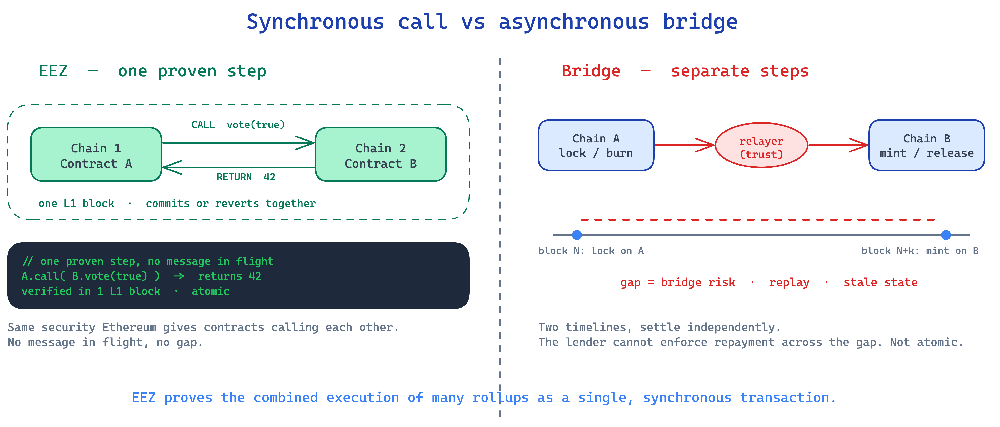
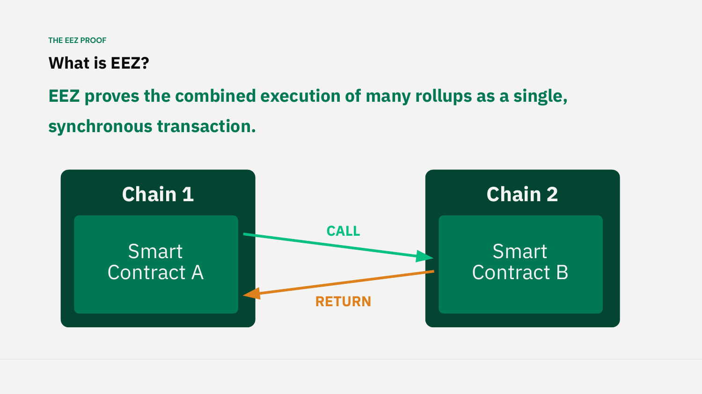
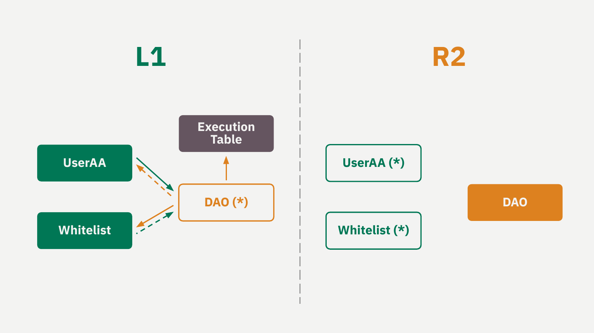
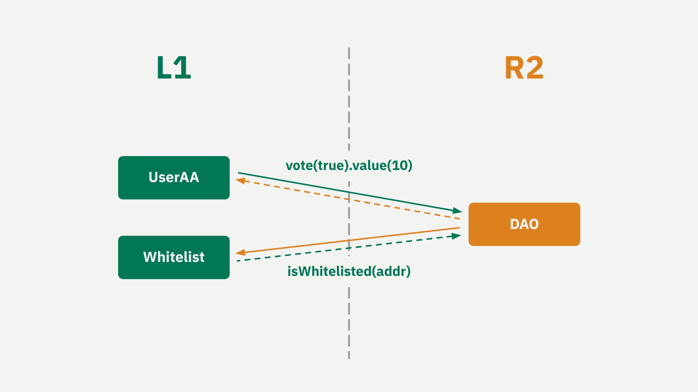

# The EEZ Proof: Synchronous Cross-Rollup Execution

*Explainer 1 of 8. [Series index](README.md). Status, sourcing and caveats: [Conventions & Caveats](00-conventions-and-caveats.md).*

This one is for builders and partners who want the core idea behind the [Ethereum Economic Zone (EEZ)](GLOSSARY.md), without the marketing around it. EEZ is an economic zone built on Ethereum, [not an L2](00-conventions-and-caveats.md). Ethereum does the proving and the settlement, and EEZ lets independent rollups call into each other as if they were one machine.

## The core claim

The DAPPCon deck frames it this way: EEZ proves the combined execution of many rollups as a single, synchronous transaction. (This is a paraphrase of the deck's framing, not a verbatim spoken quote.) Friederike put the same idea live in plainer terms: EEZ collapses settlement to Ethereum's twelve seconds, so everything in the zone is "de facto synchronous with Ethereum."

*From Jordi's DAPPCon deck (slide 2): the core claim, drawn as a CALL and RETURN between two chains.*

Read that carefully. The unit of proof is not one rollup. It is the combined execution across several rollups, treated as one atomic step. When a contract on one rollup calls a contract on another, both sides of that interaction land in the same proven batch. They either both happen or neither does.

This is the difference that matters. Most cross-chain systems today break an interaction into two separate events on two separate timelines. EEZ keeps it as one event.

One honest qualifier before we go further. The "many rollups" picture is the design goal. Shipped code today scopes this to based rollups that share an L1 sequencer, and the atomic step is bounded to a single L1 block. See [Conventions & Caveats](00-conventions-and-caveats.md).

## How a cross-chain call actually works

Underneath, it is an ordinary Ethereum CALL and RETURN. The only twist is that the two contracts live on different chains.

A contract on Chain 1 calls a contract on Chain 2. Chain 2 runs the function and returns the answer. To the caller it looks like any other contract call. It does not know the callee sits on a different rollup, and it does not need to.

L1 is where the two chains meet. Every contract that takes part has a [proxy](GLOSSARY.md) on L1, a stand-in for the real contract back on the rollup. The deck draws them with a star: `UserAA(*)`, `Whitelist(*)`, `DAO(*)`. The proxy writes each call and each return into an [Execution Table](GLOSSARY.md) on L1, which is the running record of who called whom and what came back.

*From Jordi's DAPPCon deck (slide 4): the L1 proxies and the Execution Table.*

The proxies hold no state of their own. They are forwarders. The shared state lives one level up, in the atomic step that resolves across rollups. That is the part a bridge cannot give you, and it is worth seeing why.

## One step, not two

"Synchronous" has a precise meaning here. The call and its result resolve inside one proven step, before anything settles. The caller asks its question and gets the answer in the same atomic unit.

Message passing works the other way. Chain A emits a message. A relayer or light client picks it up later. Chain B acts on it in some future block. Chain A might learn the outcome a block or two after that. Every hop is its own transaction on its own timeline, and the gaps between them are where bridge risk, replay risk, and stale state creep in.

EEZ removes the gaps. The call, the work on the other chain, and the return are all captured in one [EEZ Trace](GLOSSARY.md), which records each switch between chains and how any revert is handled. The [composer](GLOSSARY.md) assembles the cross-chain bundle, the proof is built alongside it, and the whole thing fits inside a single L1 slot (see the [timing model](00-conventions-and-caveats.md) and [Explainer 7](07-real-time-proving-zisk.md)).

Because it is proven as one step, there is never a moment where Chain 1 has acted and Chain 2 has not.

## What this means for security

The benchmark is easy to state. When contract A calls contract B on Ethereum today, you do not worry that B gets the call but A never sees the return, or that someone replays it. One consensus settles both halves together. EEZ tries to give you that same guarantee when A and B sit on different rollups.

What backs it is proof, not a trusted middleman. EEZ is [proof-system agnostic and multi-prover-capable](00-conventions-and-caveats.md). Each rollup picks its own proving systems and its own threshold on its [manager contract](GLOSSARY.md), so the number of proofs is the rollup's choice, not a fixed minimum. A cross-rollup call holds when the rollup's configured proofs agree. There is no single prover or relayer to trust.

## It is not a bridge

A bridge moves an asset or a message from one chain to another. It locks or burns on one side, then mints or releases on the other, with validators or a committee in between. The two sides are joined by a message, and the join is only as strong as whatever secures that message. By construction it is asynchronous: source first, destination later.

EEZ does not move anything between chains like that. The contracts call each other directly through their proxies, and the combined result is proven as one transaction. Nothing sits in flight between two separate confirmations, and there is no relayer in the middle.

Two ideas often get mixed up here, so keep them apart. Synchronous composability is about the call and return resolving in one proven step. How long final L1 settlement takes is a separate question, and it depends on the [path](00-conventions-and-caveats.md).

## A worked example

Here is the deck's own illustration. (The live demo at the workshop was a simpler one: an ENS-style registry, registering a name from L1 through the proxy. It reverted a few times before it worked.)

*From Jordi's DAPPCon deck (slide 3): the DAO-vote example, UserAA / Whitelist / DAO.*

A user on one rollup wants to vote in a DAO on another rollup, and the DAO only accepts votes from whitelisted accounts. On Rollup R2 there are three real contracts: `UserAA` (the user's account), `Whitelist` (the eligibility check), and `DAO` (governance). On L1 they show up as proxies: `UserAA(*)`, `Whitelist(*)`, `DAO(*)`.

The flow is just a chain of ordinary calls and returns:

1. `UserAA` calls `DAO` to cast a vote.
2. `DAO` calls `Whitelist` to check that `UserAA` is eligible.
3. `Whitelist` runs the check and returns the answer.
4. `DAO` records the vote and returns to `UserAA`.

Every one of those switches is written into the Execution Table and captured in the EEZ Trace, and the whole sequence is proven as one transaction.

Now the point of the example. If the whitelist check fails, the vote is not recorded, and the revert sits in the trace. There is no in-between state where the DAO has half-counted a vote from an account it never confirmed. A bridge-and-message design would split the check and the vote into separate hops, and the gap between them would be the risk. Here there is no gap and no message in flight. There is one step.

(Inside each native rollup these are [execution entries](00-conventions-and-caveats.md), not transactions. "Transaction" is kept for the L1 layer.)

## Why this matters if you build

Building across rollups today, you pay for the asynchrony yourself. You write the relayer logic, you handle the case where one side confirmed and the other did not, and you trust whatever bridge sits in the middle. EEZ's pitch is that you can drop all of that and write a plain contract-to-contract call, proven atomically.

One caveat comes with that "plain call." A proxy call only resolves if the composer has pre-registered the lookup for it in the bundle. Call the proxy outside the bundle and it reverts, because the lookup is not there. That breaks any spec that must not revert, an ERC-20 `balanceOf` for example, so leaning on a proxy call where a revert is unacceptable is a design mistake. You also cannot send these through the public L1 mempool. They have to go via the composer, the bundle, or account abstraction.

There is a trust assumption today as well. Inside the L1 block the composer's transaction goes first and the user's second. A builder could include the user's transaction without the composer's, and then it simply reverts. Nothing in the L1 protocol enforces that ordering yet.

And to be clear about where this stands: EEZ is not live. It is a design to build against and plan for, not a network you can join today (see the [roadmap context](README.md)).

*Source: `knowledge/eez/sources/dappcon-2026-eez-node-architecture.md` (DAPPCon EEZ Workshop, 17 June 2026, Jordi Baylina). Engineering-level founding material, quoted as Jordi's framing.*
