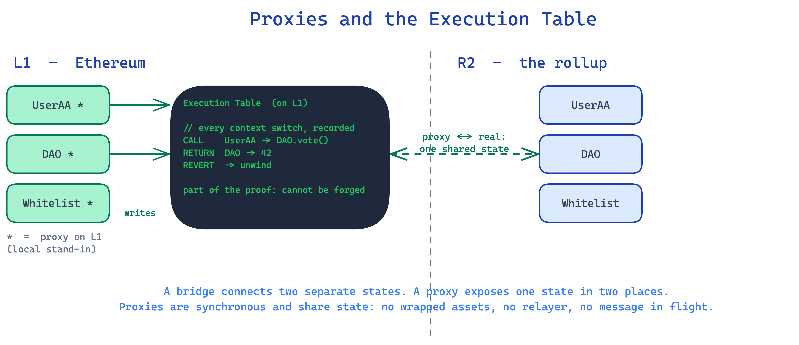
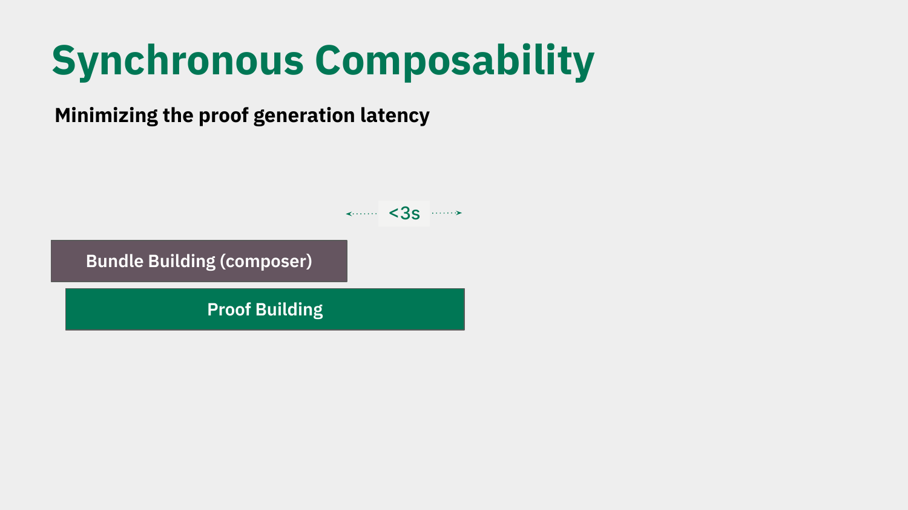

# Proxies and the Execution Table

*Explainer 2 of 8. [Series index](README.md). Status, sourcing and caveats: [Conventions & Caveats](00-conventions-and-caveats.md).*

---

## The one idea to take away

A contract living on one rollup can be called by a contract on another rollup as if both sat on the same machine. The call is a normal Ethereum `CALL`. The reply is a normal `RETURN`. No asset gets wrapped, no message gets relayed, no third party gets trusted to carry it across.

EEZ does this with [proxies](GLOSSARY.md) and an [Execution Table](GLOSSARY.md) on L1. This explainer makes that pairing concrete. It is the heart of "proxies, not bridges".

---

## What a proxy is

[EEZ](GLOSSARY.md) is an economic zone built on Ethereum, not an L2. Inside it, rollups stay sovereign: each keeps its own state, rules, and accepted proof systems.

When a contract on one rollup needs to be reachable from another, EEZ represents it on L1 as a [proxy](GLOSSARY.md) of the real contract, drawn with a star. `UserAA(*)`, `Whitelist(*)` and `DAO(*)` are the L1 proxies; the real `UserAA`, `Whitelist` and `DAO` live on the rollup (the deck uses R2 as the example).

*From Jordi's DAPPCon deck (slide 4): the L1 proxies and the Execution Table.*

The proxy is not a copy of the contract's logic. It is the synchronous reference point that lets L1 (and other rollups through L1) address that contract and share its state. Two properties matter, and they are exactly what a bridge does not give you:

**Synchronous.** A proxy resolves within the same proving window as the call that touched it. It does not wait for a separate confirmation cycle on another chain.

**Shared state.** L1 never holds a second copy of the contract's storage. The proxy is a stateless stand-in that stores only immutables and forwards calls, while L1 maintains a proven state-root commitment to the single state that lives on the rollup, advanced by proven state deltas. There is no source-of-truth contract on one side and a mirror on the other. There is one state on the rollup and a proven commitment to it on L1.

---

## What the Execution Table is

The [Execution Table](GLOSSARY.md) records the cross-chain calls and returns on L1 as they happen. When the L1 `DAO(*)` proxy takes part in a cross-chain interaction, it writes the call (and later the return) into the table. A `CALL` from chain 1 into a contract on chain 2 is an entry; the matching `RETURN` is an entry; a revert is recorded too. These are [execution entries](GLOSSARY.md) in the combined execution, not L1 transactions in their own right.

It is the actively-proven, L1-visible face of the combined execution. Not a passive log written after the fact, but the on-L1 record that the proof attests to. Because it lives on L1, every chain agrees on what happened without any chain syncing another's full state. A node that follows one rollup builds its state from L1 and its own chain only.

The deck pairs this with the proving side: the combined execution of many rollups is proved as a single, synchronous transaction. The [EEZ Trace](GLOSSARY.md) records each context switch, and the proof attests that the whole thing, across all chains involved, is valid together. The Execution Table is the L1-visible face of that combined execution.

---

## Why this is not a bridge

A bridge moves value or messages between two chains that do not share state. To do that it wraps assets, relays messages, and asks you to trust whatever relays them. The two chains stay separate and reconcile after the fact. EEZ does none of that:

**No wrapped assets.** ETH stays ETH. For native-ETH rollups, a `CALL` can carry ETH directly, with no wrapped representation to mint and burn.

**No message relay.** The interaction is a plain `CALL` and `RETURN` between contracts, written into the Execution Table on L1. There is no separate messaging layer carrying a payload from A to B.

**No relay trust.** You are not trusting validators or a multisig to attest that a message crossed. The combined execution is proved by the proving systems each rollup configures (EEZ is proof-system agnostic and [multi-prover-capable](00-conventions-and-caveats.md)), so the trust rests on proofs, not a relayer or committee.

**Shared state, not reconciled state.** Because the proxy and its real contract share one state through L1, there is nothing to reconcile later. The deck states the security goal plainly: the same security Ethereum gives independent smart contracts that call each other.

*From Jordi's DAPPCon deck (slide 5): the seven EEZ properties (property 6 is the cross-rollup security goal).*

A bridge connects two separate states; a proxy exposes one state in two places. That is why "bridge" is the wrong word for anything EEZ-native.

---

## Cross-rollup ETH transfers

*The mechanics below describe the design as specified; they are not yet shipped. See the [status note](00-conventions-and-caveats.md).*

[Native rollups](GLOSSARY.md) can include ETH inside a cross-rollup `CALL`. There is no wrapping: a cross-rollup ETH transfer is a plain `CALL` carrying value on the call's value field, not a wrapped ERC-20 to mint and burn. Underneath, L1 keeps per-rollup ETH accounting: each rollup has an `etherBalance` tracking the ETH held on its behalf. When ETH crosses, it is burned to the system address on the source side and minted on the destination side, with the total conserved across rollups. The EEZ contract records the transfer as part of the Execution Table, the same record that holds every other call and return.

So it is native ETH, accounted on L1. The accounting is not visible to your contract: from the developer's side it is still a plain `CALL`/`RETURN`; no wrapped token appears on either side.

---

## What a developer sees versus what happens underneath

**What you write looks ordinary.** Your contract on rollup A calls a contract on rollup B. In your code it is a `CALL` to an address, with a `RETURN` coming back, and ETH attached if you need it. You do not write bridge glue, you do not mint or burn a wrapped token, and you do not wait on a relayer.

**What happens underneath** (as designed, not yet shipped; see the [status note](00-conventions-and-caveats.md)). On L1, the target contract is represented by its proxy (the starred contract). The proxy writes the `CALL` into the Execution Table. The combined execution across the involved rollups is proved together by the rollups' configured proving systems, with each context switch recorded in the EEZ Trace. The `RETURN` is written back into the table, and any ETH moves as value on the same `CALL`, recorded as an entry in the table like everything else.

The point of the design is that the second paragraph stays out of your way. You get a cross-chain call that reads and behaves like a same-chain call, with shared state and no wrapped assets, because the proxy and the Execution Table do the work on L1.

---

## How a call is actually delivered

*Mechanism as designed, not yet shipped. See the [status note](00-conventions-and-caveats.md).*

A proxy on its own does not know what the real contract on the other rollup would return. A [composer](GLOSSARY.md) supplies that. The composer anticipates the call, simulates it on the L2, and pre-loads a lookup table so the proxy can return the right value when it is hit.

In practice the interaction arrives as a bundle of up to three transactions:

1. Deploy the proxy, if it does not already exist.
2. Load the lookup table.
3. The user transaction hits the proxy → the proxy looks up the anticipated result → returns it.

Ordering inside the L1 block is fixed: the composer/proof transaction lands **first**, the user transaction **second**. Only the user transaction triggers the L2 state change. No user transaction, no state change.

---

## The one caveat: proxies revert outside the bundle

If you call a proxy **outside** the composer bundle, it reverts. The lookup is not found. This is the single most important thing for a builder to internalise.

It breaks contract specs that must never revert. A standard ERC-20 `balanceOf`, for example, is expected to always return, but a proxy without a pre-loaded lookup will revert instead. It also means you **cannot use the public L1 mempool**: a transaction sent there will simply revert. You must route the call through the composer, a bundle, or account abstraction.

As Jordi put it, depending on a revert for your logic is "a design flaw". A call can revert for many reasons (out of gas, for one), so any spec that assumes a contract never reverts is already on shaky ground.

---

## Gas and who pays

*Approximate figures from the workshop; treat as rough and path-dependent.*

The **user pays**: a small transaction that calls the proxy, plus a larger tip. The composer fronts the cost of the extra transactions in the bundle, and the builder returns enough to the composer to cover them.

There is a trust assumption here, and it is honest: a builder could include the user transaction **without** the composer transaction, in which case it reverts. The L1 protocol does not enforce the pairing.

An **account-abstraction** path puts the whole sequence (deploy, load, call) into one transaction using transient storage. That is much cheaper than the real-storage path, and the user only pays if it does not revert.

Rough costs, with the path named:

- Full real-storage path: ≈ 400K gas.
- A normal L1→L2 call: ≈ 300K gas (roughly ~10× cheaper when routed as a meta-transaction).
- AA / transient-storage path: much cheaper than the real-storage path (no specific multiplier from the workshop).

---

## Stateless proxies and msg.sender

A proxy is a stateless forwarder. Its bytecode holds only the EEZ contract address and which `(address, chain)` it represents. No storage, no locally stored owner (ownership lives in the EEZ contract). It forwards any ETH immediately and cannot self-destruct.

When you call from L1, the `msg.sender` seen on L2 is the **proxy of your EOA**, not the EOA itself. Each address has a deterministic alias, one proxy per chain, so your identity is portable but distinct on each chain. Nonces stay on the originating chain.

---

## Timing

Settlement time depends on the path: see the [canonical timing model](00-conventions-and-caveats.md). The deck describes bundle building and proof building running overlapped, targeting under 3 seconds so a native cross-chain interaction fits inside one L1 slot.

*From Jordi's DAPPCon deck (slide 54): bundle building and proof building overlapped, under three seconds.*

---

*Source: `knowledge/eez/sources/dappcon-2026-eez-node-architecture.md` (DAPPCon Berlin 2026 EEZ workshop, Jordi Baylina, 17 June 2026).*
