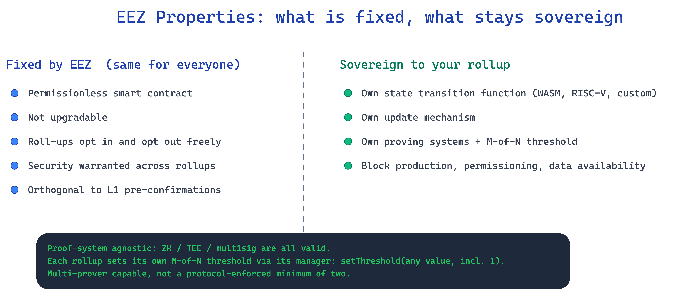

# EEZ Properties and Rollup Sovereignty

*Explainer 3 of 7. Source: `knowledge/eez/sources/dappcon-2026-eez-node-architecture.md` (DAPPCon 2026 EEZ Workshop, Jordi Baylina, 17 June 2026), Part 1, "EEZ Properties (canonical 7-point spec)". Quote the figures here as Jordi's engineering-level framing, not as approved EEZ comms.*

## Why these properties matter

The Ethereum Economic Zone (EEZ) is an economic zone built on Ethereum, not an L2. It lets many rollups prove the combined execution of their cross-chain calls as a single, synchronous transaction. A cross-chain interaction is a normal Ethereum CALL and RETURN between smart contracts on different chains, settled through proxies on L1, not a bridge and not message passing.

If you are a builder deciding whether to join, the question underneath all of this is simple. What do I give up, and what do I keep. The deck answers that with seven properties. Read together, they say you keep almost everything about your own chain's design, and you gain the ability to call into and be called by every other rollup in the zone as if they were local contracts.

It helps to read the seven in two groups. Properties 1, 2, and 3 are about the zone's posture towards you. It is open, fixed, and reversible. Properties 4, 5, and 6 are about your chain's relationship to its own design and to the other rollups. You keep your internals, you choose your own proving setup, and you inherit a strong cross-chain security guarantee. Property 7 is about what the zone does not entangle you with on L1. Each property is a genuine list item, so it gets its own numbered section, but the reasoning for each is in prose.

## 1. Permissionless smart contract

EEZ is a smart contract. Anyone can interact with it without asking a gatekeeper for access. There is no application form, no approval committee, and no allowlist standing between you and the zone.

For a builder this is the difference between integrating with a protocol and negotiating with an organisation. You read the contract, you meet its interface, and you join. The cost of entry is technical conformance, not relationship management. It also means no single party can quietly deny you access later, because access is a property of the code, not of a decision-maker.

## 2. Not upgradable

The EEZ contract is not upgradable. Once deployed, the rules of the zone do not change underneath you through an admin key or a proxy upgrade.

This matters because the usual risk in committing your chain to shared infrastructure is that the infrastructure changes its terms after you have built on it. An upgradable contract is a standing power held by whoever controls the upgrade. Removing that power means the guarantees you read on day one are the guarantees you still have a year later. You are building on a fixed surface, not a moving one. Note that "not upgradable" applies to the zone contract itself. Each rollup still controls how its own chain evolves, which is property 5.

## 3. Rollups can opt in and opt out freely

A rollup joins EEZ when it wants to, and it leaves when it wants to. Participation is not a one-way door and not a lock-in.

The practical effect is that joining the zone is a low-regret decision. You are not signing away your independence or your exit. If the zone stops serving your chain, you can step out without unwinding a permanent commitment. This freedom is what makes the rest of the properties safe to rely on. Opt-in only has weight when opt-out is real, and here it is.

## 4. Proof-system agnostic, multi-prover capable

EEZ does not mandate one proving technology. A rollup can be backed by ZK-based proofs, a TEE, or a multisig. The zone verifies whatever proof systems a rollup declares, rather than forcing a single house standard on everyone.

"Agnostic" means you choose which systems, for example Zisk plus SP1, or a ZK system plus a TEE. Each rollup also sets its own threshold, an M-of-N choice held on its own manager contract, not on the zone registry. The deck's proving structures (`ProofSystemBatchPerVerificationEntries`, `RollupIdWithProofSystems`, `_fetchVkMatrix`) build a per-rollup verification-key matrix, and the manager's `checkProofSystemsAndGetVkeys` reverts with `ThresholdNotMet` when a batch supplies fewer proofs than the rollup's chosen threshold, or `ProofSystemNotAllowed` for a system the rollup has not declared. The contract does not force a minimum of two. A rollup owner can set the threshold to one, so a single-prover configuration is valid if that is what the owner picks.

Why most rollups use two or more. A second proving system is a fallback against a bug or a compromise in the first. If one system is sound, the combination does not regress. The choice is also a cost and latency lever, not only a safety net: a cheaper proving system, including a TEE or a multisig, gives you the luxury to wait longer, so you can trade proving cost against settlement timing. Multi-prover is the security design intent, and a likely EEZ-zone policy recommendation, but it stays the rollup's configurable choice rather than a contract floor. You pick the systems and the threshold that fit your trust assumptions and your cost profile.

## 5. Rollups are sovereign

This is the property that defines the relationship. Each rollup is sovereign and is governed by its own rollup smart contract. Each rollup defines its own rules, its own state transformation function, and its own accepted proving systems.

Concretely, sovereignty means the zone does not dictate your chain's internals. You set your own state transition function, which can be WASM, RISC-V, or something custom. You choose your accepted proving systems, subject to the threshold your rollup sets (property 4). You decide your own update mechanism, so how your chain evolves is your call, not the zone's. Native rollups can include ETH inside cross-rollup CALLs, where moving ETH across rollups is simply a call with value rather than a dedicated L1 ledger. Rollup creation is itself permissionless.

The trade you are being offered is the heart of EEZ. You keep full control of your own design, and in return you gain cross-rollup composability. You do not surrender your execution model to get interoperability. A contract on your chain can CALL a contract on another rollup and receive a RETURN, in the same synchronous flow, while both chains keep their own rules. Inside a native rollup these operations are execution entries, not transactions. Sovereignty is not a slogan here. It is the specific guarantee that joining the zone does not flatten your chain into a common template.

## 6. Security warranted across rollups

EEZ warrants security across rollups. The deck frames the guarantee plainly. It is the same security Ethereum provides to independent smart contracts calling each other.

The point is that a cross-rollup call should feel as safe as a local call. When contract A on one rollup calls contract B on another, A is not exposed to weaker guarantees because B lives elsewhere. The combined execution is proven as one synchronous unit, so the call either completes correctly across both chains or it reverts with revert information carried through. For a builder, this is what makes composability usable rather than merely possible. You can reason about a cross-rollup call with the same mental model you already use for calling another contract on Ethereum, including how failure is handled.

## 7. Orthogonal to L1 pre-confirmations

EEZ is orthogonal to L1 pre-confirmations. The zone's design does not depend on pre-confirmations, and it does not interfere with them.

Orthogonal is the precise word. These are two independent mechanisms that can coexist. If Ethereum L1 adopts pre-confirmations, EEZ does not have to be redesigned around them, and a chain using pre-confirmations does not have to drop them to join the zone. For a builder this removes a coupling risk. You are not betting your participation on a particular L1 roadmap outcome, and you are not forced to choose between EEZ and a pre-confirmation strategy.

## What sovereignty buys you

Put the seven together and the offer is coherent. You join a fixed, permissionless contract that you can leave at will. You keep your state transition function, your update mechanism, and your choice of proving systems and threshold. In exchange you get cross-rollup composability with a security guarantee modelled on Ethereum's own, and none of it ties you to a specific L1 pre-confirmation future.

Sovereignty is the load-bearing idea. In most shared-infrastructure designs, interoperability is paid for with conformance. You adopt the shared execution model, the shared prover, or the shared governance, and that is the price of being able to talk to your neighbours. EEZ inverts that. The zone standardises the interface for cross-chain CALL and RETURN, and almost nothing else. Your chain stays your chain. The composability is additive, not a replacement for your own design.

A concrete example makes the trade clear. Say you run a rollup with a custom RISC-V state transition function and your own fee logic, and you want a contract on your chain to draw on liquidity that lives on a different rollup in the zone. You do not port your contract, rewrite it for a shared VM, or hand your chain to a common sequencer. Your contract issues a normal Ethereum CALL to the contract on the other rollup and receives a RETURN, settled through proxies on L1, and both chains keep their own rules throughout. Inside your own rollup, the steps of that flow are execution entries. Your custom STF is untouched, your proving systems and threshold are your choice, and the only thing you adopted was the call interface. That is what "you keep full control of your own design while gaining cross-rollup composability" means in practice.

A word on settlement timing, because builders ask about it immediately. EEZ has more than one path and they have different finality profiles. The async path settles in roughly 20 minutes. Native rollups settle in roughly 12 seconds. There is no single finality number for EEZ as a whole, so always name the path you mean.

One more thing to be clear about. EEZ is not deployed yet. The roadmap runs through smart-contract cleanup, an audit, the signature and Zisk proving systems, Composer 1.0, Chain Zero, and then connecting Gnosis Chain. So treat this explainer as a description of the design you can build against and plan for, not as a network you can join today.

## Accuracy notes

- **Economic zone, not an L2.** EEZ is an economic zone built on Ethereum. It is never described here as an L2 or a Layer 2 network. Native rollups are an L2-style construction, but the zone sits on top of that construction, it is not equivalent to it.
- **Proof-system agnostic and multi-prover capable.** Property 4 means a rollup chooses which proving systems and sets its own threshold (one or more) on its own manager contract. There is no protocol-enforced minimum of two. The manager's `checkProofSystemsAndGetVkeys` reverts `ThresholdNotMet` when a batch supplies fewer proofs than the rollup's threshold. `InvalidProofSystemConfig()` is a separate registry-side error for structural batch validation, not the threshold check, so do not conflate the two.
- **Proxies, not bridges.** Cross-chain interaction is normal Ethereum CALL and RETURN, settled through proxies on L1. The word "bridge" is not used for anything EEZ-native.
- **Execution entries, not transactions.** Operations inside a native rollup are execution entries. "Transaction" is reserved for the L1 layer.
- **Finality figures name the path.** Async path roughly 20 minutes, native rollups roughly 12 seconds. No single finality number applies to EEZ as a whole.
- **Not deployed yet.** EEZ is pre-launch. No "join today" claim appears. Joining is described as a future capability per the roadmap (Composer 1.0, Chain Zero, connecting Gnosis Chain).
- **Source is engineering-level framing.** Figures and the 7-point spec are from Jordi Baylina's DAPPCon 2026 workshop deck, to be quoted as his framing, not as approved EEZ comms.
