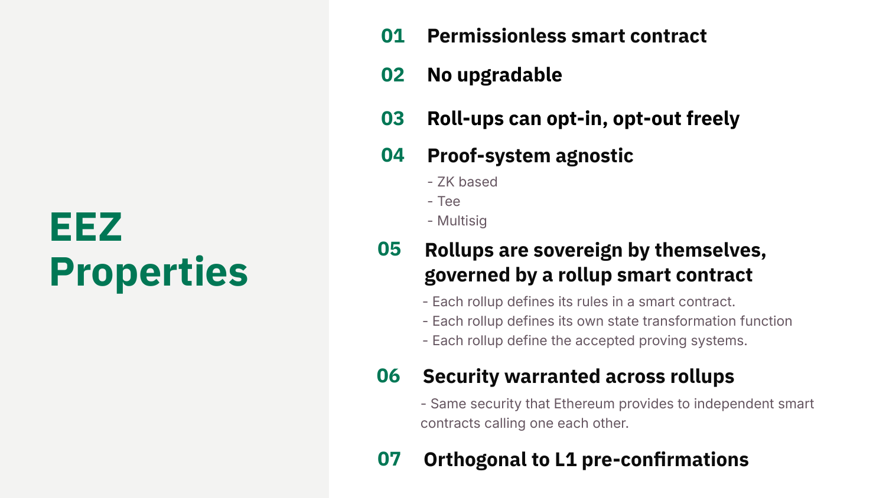
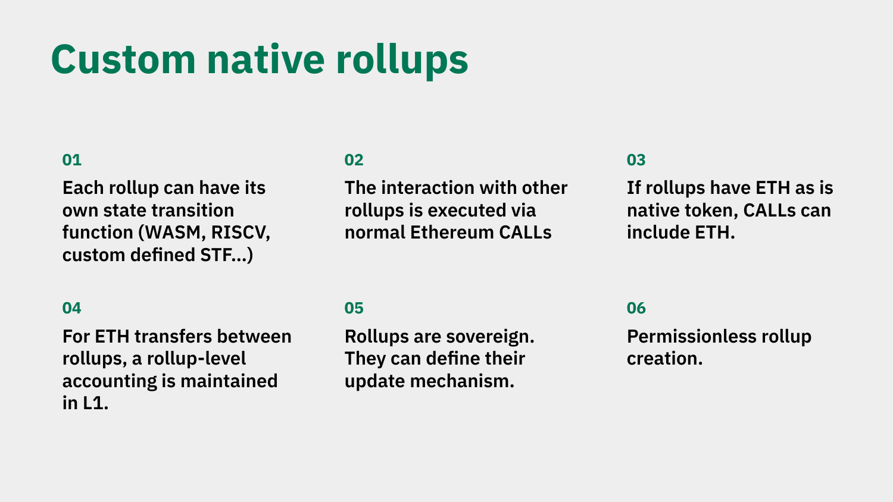

# EEZ Properties and Rollup Sovereignty

*Explainer 3 of 8. [Series index](README.md). Status, sourcing and caveats: [Conventions & Caveats](00-conventions-and-caveats.md).*

## Why these properties matter

[EEZ](GLOSSARY.md) is an economic zone built on Ethereum, not an L2. It lets many rollups prove the combined execution of their cross-chain calls as a single, [synchronous](GLOSSARY.md) transaction. A cross-chain interaction is a normal Ethereum CALL and RETURN between contracts on different chains, settled through [proxies](GLOSSARY.md) on L1. Not a bridge, not message passing.

If you are a builder deciding whether to join, the question underneath all of this is simple: what do I give up, and what do I keep? The deck answers with seven properties.

*From Jordi's DAPPCon deck (slide 5): the seven EEZ properties.*

Read together, they say you keep almost everything about your own chain's design, and you gain the ability to call into and be called by every other rollup in the zone as if they were local contracts.

| # | Property | What it gives you | What stays your choice |
|---|---|---|---|
| 1 | Permissionless smart contract | Join by meeting an interface, not by asking a gatekeeper | |
| 2 | Not upgradable | Day-one guarantees still hold a year later | How your own chain evolves (see 5) |
| 3 | Opt in / opt out freely | Joining is low-regret; exit is real | When to join and when to leave |
| 4 | Proof-system agnostic, multi-prover capable | Verifies whatever systems you declare | Which proof systems, and your M-of-N threshold |
| 5 | Rollups are sovereign | The zone never dictates your internals | STF, update mechanism, proving setup |
| 6 | Security warranted across rollups | A cross-rollup call as safe as a local one | |
| 7 | Orthogonal to L1 pre-confirmations | No coupling to a particular L1 roadmap | Whether to use pre-confirmations |

The seven read in two groups. Properties 1–3 are the zone's posture towards you: open, fixed, reversible. Properties 4–6 are your chain's relationship to its own design and to the others: you keep your internals, choose your proving setup, and inherit a strong cross-chain guarantee. Property 7 is what the zone does *not* entangle you with on L1.

## 1. Permissionless smart contract

EEZ is a smart contract. Anyone can interact with it without asking a gatekeeper: no application form, no approval committee, no allowlist.

For a builder this is the difference between integrating with a protocol and negotiating with an organisation. You read the contract, meet its interface, and join. The cost of entry is technical conformance, not relationship management. No single party can quietly deny you access later, because access is a property of the code.

## 2. Not upgradable

The EEZ contract is not upgradable. Once deployed, the rules of the zone do not change underneath you through an admin key or a proxy upgrade.

The usual risk in committing your chain to shared infrastructure is that the infrastructure changes its terms after you have built on it. Removing the upgrade power means the guarantees you read on day one are the guarantees you still have a year later. Note that "not upgradable" applies to the zone contract itself. Each rollup still controls how its own chain evolves (property 5).

## 3. Rollups can opt in and opt out freely

A rollup joins EEZ when it wants to and leaves when it wants to. Participation is not a one-way door.

This makes joining a low-regret decision. You are not signing away your independence or your exit; if the zone stops serving your chain, you can step out without unwinding a permanent commitment. Opt-in only has weight when opt-out is real, and here it is. That is what makes the rest of the properties safe to rely on.

## 4. Proof-system agnostic, multi-prover capable

EEZ does not mandate one proving technology. A rollup can be backed by ZK-based proofs, a TEE, or a multisig. The zone verifies whatever proof systems a rollup declares, rather than forcing a single house standard.

"Agnostic" means you choose which systems (for example ZisK plus SP1, or a ZK system plus a TEE). Each rollup also sets its own threshold, an M-of-N choice held on its own [manager contract](GLOSSARY.md), not on the zone registry. **There is no protocol-enforced minimum of two:** a rollup owner can set the threshold to any value, including one (the contract natspec explicitly allows 0), so a single-prover configuration is valid if that is what the owner picks. This is the threshold rule stated in full; see [Conventions & Caveats](00-conventions-and-caveats.md) for the rest.

Most rollups still use two or more. A second proving system is a fallback against a bug or compromise in the first: if one system is sound, the combination does not regress. Redundant proving is also a cost and latency lever, not only a bug hedge. Cheaper proving systems (including a TEE or a multisig) buy the luxury of waiting longer, so you can trade proving cost against settlement latency. Multi-prover is the security design intent and a likely zone-policy recommendation, but it stays a configurable choice rather than a contract floor. You pick the systems and threshold that fit your trust assumptions and cost profile.

**For builders:** the manager's `checkProofSystemsAndGetVkeys` reverts `ThresholdNotMet` when a batch supplies fewer proofs than the rollup's chosen threshold, or `ProofSystemNotAllowed` for an undeclared system. The proving structures `ProofSystemBatchPerVerificationEntries`, `RollupIdWithProofSystems`, and `_fetchVkMatrix` build the per-rollup verification-key matrix. `InvalidProofSystemConfig()` is a separate registry-side error for structural batch validation, not the threshold check. Do not conflate the two. (These names are current as of June 2026 against an unaudited, explicitly not-production-ready contract; error semantics may change.)

## 5. Rollups are sovereign

This is the property that defines the relationship. Each rollup is sovereign and governed by its own rollup smart contract, defining its own rules, [state transition function](GLOSSARY.md), and accepted proving systems.

Concretely, the zone does not dictate your chain's internals. You set your own STF (WASM, RISC-V, or custom). You choose accepted proving systems, subject to the threshold your rollup sets (property 4). You decide your own update mechanism. Your data-availability choice is yours too. Validiums are fine in EEZ, though that choice carries an obligation: the composer and any followers must be able to access the off-chain data. [Native rollups](GLOSSARY.md) can carry ETH as value inside cross-rollup CALLs, so a cross-rollup transfer rides the same call interface rather than a separate path. Rollup creation is itself permissionless.

*From Jordi's DAPPCon deck (slide 6): custom native rollups.*

The trade is the heart of EEZ: you keep full control of your own design, and in return you gain cross-rollup composability. You do not surrender your execution model to get interoperability. A contract on your chain can CALL a contract on another rollup and receive a RETURN in the same synchronous flow, while both chains keep their own rules. Inside a native rollup these operations are [execution entries](GLOSSARY.md), not transactions. Joining the zone does not flatten your chain into a common template.

## 6. Security warranted across rollups

EEZ warrants security across rollups. The framing is plain: the same security Ethereum provides to independent smart contracts calling each other.

A cross-rollup call should feel as safe as a local call. When contract A on one rollup calls contract B on another, A is not exposed to weaker guarantees because B lives elsewhere. The combined execution is proven as one synchronous unit, so the call either completes correctly across both chains or reverts with revert information carried through. For a builder, this is what makes composability usable rather than merely possible: you can reason about a cross-rollup call with the same mental model you use for any Ethereum contract call, including failure handling.

## 7. Orthogonal to L1 pre-confirmations

EEZ is orthogonal to L1 pre-confirmations. The zone's design does not depend on them and does not interfere with them.

Orthogonal is the precise word: two independent mechanisms that can coexist. If Ethereum L1 adopts pre-confirmations, EEZ does not have to be redesigned around them, and a chain using pre-confirmations does not have to drop them to join. For a builder this removes a coupling risk. You are not betting your participation on a particular L1 roadmap outcome, and you are not forced to choose between EEZ and a pre-confirmation strategy.

## What sovereignty buys you

Put the seven together and the offer is coherent. You join a fixed, permissionless contract you can leave at will. You keep your state transition function, your update mechanism, and your choice of proving systems and threshold. In exchange you get cross-rollup composability with a security guarantee modelled on Ethereum's own, none of it tying you to a specific L1 pre-confirmation future.

In most shared-infrastructure designs, interoperability is paid for with conformance: you adopt the shared execution model, prover, or governance, and that is the price of talking to your neighbours. EEZ inverts that. The zone standardises the interface for cross-chain CALL and RETURN, and almost nothing else. Your chain stays your chain; the composability is additive.

Worked example (this is the design you build against; shipped code currently scopes synchronous composability to based rollups sharing an L1 sequencer): say you run a rollup with a custom RISC-V state transition function and your own fee logic, and you want a contract on your chain to draw on liquidity that lives on a different rollup in the zone. You do not port your contract, rewrite it for a shared VM, or hand your chain to a common sequencer. Your contract issues a normal Ethereum CALL to the contract on the other rollup and receives a RETURN, settled through proxies on L1. Both chains keep their own rules throughout. Inside your own rollup, the steps of that flow are execution entries. Your custom STF is untouched, your proving systems and threshold are your choice, and the only thing you adopted was the call interface. That is what "you keep full control of your own design while gaining cross-rollup composability" means in practice.

Settlement timing has more than one path with different finality profiles. Always name the path you mean (see the [canonical timing model](00-conventions-and-caveats.md)). EEZ is also not deployed yet; treat this as a design you can build against, not a network you can join today (see [status](00-conventions-and-caveats.md)).

*Source: `knowledge/eez/sources/dappcon-2026-eez-node-architecture.md` (DAPPCon 2026 EEZ Workshop, Jordi Baylina, 17 June 2026), Part 1, "EEZ Properties (canonical 7-point spec)".*
