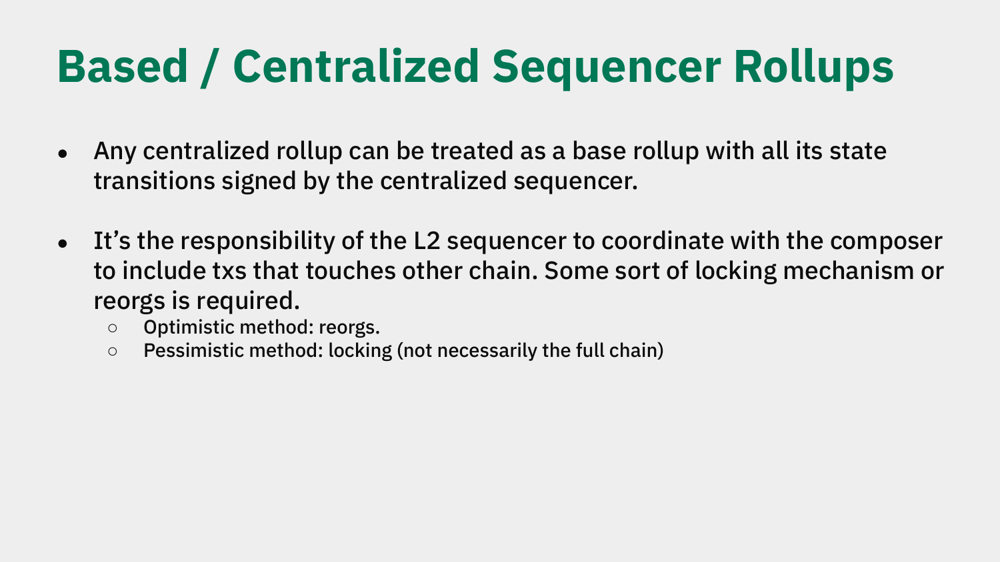
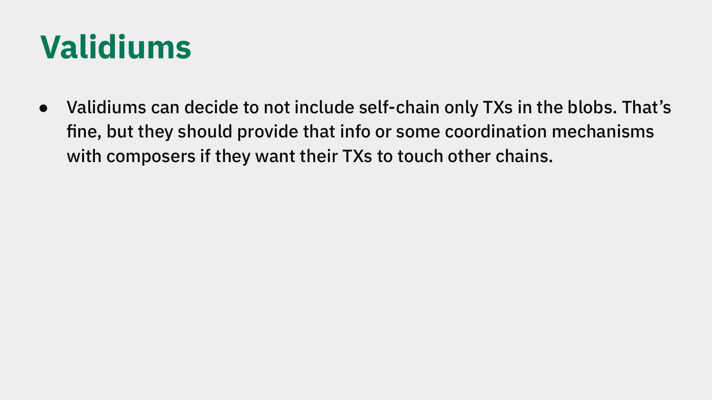

# Chain Types and Cross-Chain Coordination

*Explainer 4 of 8. [Series index](README.md). Status, sourcing and caveats: [Conventions & Caveats](00-conventions-and-caveats.md).*

The Ethereum Economic Zone is not one chain. It is an economic zone built on Ethereum that lets many rollups behave as one synchronous system. Rollups are built in different ways, and EEZ has to account for that. The DAPPCon deck names three chain types; the workshop recording adds a fourth (specialized, non-EVM state-transition functions). For each, there is how that chain joins the zone and what it owes the rest of the system. This explainer walks the types, then the two coordination methods ([optimistic vs pessimistic](GLOSSARY.md)), and closes with the [binding vs non-binding](GLOSSARY.md) sequencer distinction and how it ties back to coordination.

> **Scope: vision versus shipped code.** The three chain types here describe the deck's broader *vision*. The shipped `eez-core-protocol` repo currently scopes synchronous composability to **based rollups sharing the same L1 sequencer**: it pre-computes state transitions off-chain and verifies them on-chain to enable atomic cross-rollup calls within one L1 block. Do not assume all three types are implemented today; read each as a roadmap question. (General status: [Conventions & Caveats](00-conventions-and-caveats.md).)

## The three chain types

| Chain type | Brings | Cross-chain mechanism | Finality path | Joining |
|---|---|---|---|---|
| **Custom native rollup** | Own STF (WASM, RISC-V, custom) and accepted proof systems; sovereign, governed by a rollup contract | Native CALL/RETURN between contracts on different chains via [proxies](GLOSSARY.md) (synchronous, shared state); ETH moves via L1-level ETH accounting | [Native path](00-conventions-and-caveats.md), ~12 s | Permissionless: opt in, opt out; no committee gates entry |
| **Based / centralized-sequencer rollup** | A [sequencer](GLOSSARY.md) that signs all state transitions and is the authority over inclusion and ordering | Sequencer must coordinate with the [composer](GLOSSARY.md) so cross-chain effects land atomically with the zone | Per chain's own model | Coordinate sequencer with composer |
| **Validium** | Off-chain data availability | Must expose cross-chain interactions (or a coordination mechanism) in blobs so composers can include them | Per chain's own model | Must expose its cross-chain interactions in blobs; may keep self-contained transactions off-chain |
| **Non-EVM / specialized STF** | A custom state-transition function: privacy chains (Zcash-like / privacy pools), EVM-plus-custom-precompiles, or any other "way of extending Ethereum in your own way" | Same proxy CALL/RETURN model; the chain proves its own STF, so the rest of the zone need not run that execution model | Per chain's own model | Register the rollup contract with its STF and proof system; EEZ imposes no single execution model |

A [custom native rollup](GLOSSARY.md) defines its own rules; EEZ imposes no single execution model. Inside it, operations are [execution entries](GLOSSARY.md), not transactions. ("Transaction" is the right word for L1 and for partner chains that run their own transaction model.) Cross-rollup interaction is a normal CALL and RETURN, not message passing and not a bridge: on L1 the participating contracts appear as proxies that share state. That is the concrete form of "proxies, not bridges."

*From Jordi's DAPPCon deck (slide 6): custom native rollups.*

For **based and centralized-sequencer rollups**, the deck treats any centralized rollup as a based rollup whose state transitions are all signed by the sequencer. A self-contained chain's sequencer can act alone; the moment a transaction touches another chain, the sequencer and composer must agree on inclusion. Here "transaction" is acceptable, scoped to that chain's own model. The execution-entries rule applies only to native rollups.

*From Jordi's DAPPCon deck (slide 7): based and centralized-sequencer rollups; this slide also carries the optimistic vs pessimistic coordination methods.*

For **[validiums](GLOSSARY.md)**, the data-access split matters. Self-contained work can stay private to the validium. Anything that reaches across chains must be visible to the coordination layer. The deck makes the split precise: rebuilding a validium's *full* state needs extra data from its own DA arrangement, outside the blobs; *routing calls* to or from it only needs the interactions recorded in the blobs. Other chains connecting to a validium do not need its full state, only the calls and returns that cross the boundary. The heavier data requirement falls on the composer connecting the validium, not on every chain in the zone.

*From Jordi's DAPPCon deck (slide 8): validiums.*

For **non-EVM and specialized STFs**, the recording is explicit that the execution model is open. A chain can run a privacy STF (Zcash-like, or privacy pools), EVM with custom precompiles, or anything else ("a way of extending Ethereum in your own way"). It joins the zone the same way the others do: it registers its rollup contract with its own state-transition function and accepted proof system, then proves its own STF. Because each chain proves itself, the rest of the zone never needs to run that execution model. It only verifies the proof.

## Coordination methods: optimistic and pessimistic

Cross-chain inclusion needs a way to keep participating chains consistent while an interaction is assembled and proven. The deck names two methods on a liveness-versus-safety trade-off; neither is universally better. The cascade direction is one-way: because EEZ blocks commit to a specific Ethereum block, an **Ethereum reorg forces the L2 to reorg** for any sync or async block that depended on the reorged-out L1 state (L1→L2). L2-only blocks, which touch no L1 state, never need this.

> **Shipped reality.** The shipped rollup currently implements only the optimistic / reorg path (commit first, repair by reorg if the assumption breaks). Pessimistic locking and binding-sequencer mode, including their pairings below, are design intent and not yet in code. The tables describe the intended design; read the pessimistic and binding rows as roadmap, not available options.

| Method | Mechanism | Optimizes for | Cost | Fits |
|---|---|---|---|---|
| **[Optimistic](GLOSSARY.md)** | Proceed assuming inclusion; reorg out and rebuild if the assumption breaks | Liveness, lower latency (the chain never stalls) | Recent blocks unsafe until the assumption settles; a reorg can undo work | Chains/apps valuing continuous progress that tolerate revised recent blocks |
| **[Pessimistic](GLOSSARY.md)** | Lock the affected state first, then proceed; the lock need not be the whole chain | Safety: no reorg on locked state | Locked state can't progress independently; acquiring the lock adds latency. A *full-chain* lock is the inefficient extreme. The chain stalls waiting on L1 finality, on the order of ~12–20 min, which is why partial locks exist | High-value or hard-to-reverse interactions where a reorg is unacceptable |

**Choosing between them.** Optimistic favours liveness and accepts reorg risk; pessimistic favours safety and accepts added latency on the locked state. Because locking can be *partial*, a chain can mix the two, applying pessimistic locking only on sensitive paths and optimistic everywhere else. The deck presents both as intended methods, so this is a design choice for the participating chain, not a single mandated rule.

> **Don't read the lock-stall as a finality path.** The ~12–20 min above is the cost of *stalling a full chain* while a pessimistic lock waits on L1 finality. It is not the zone's settlement timing. For the actual finality model (native, async settlement, proof), use the code-verified timing table in [Conventions & Caveats](00-conventions-and-caveats.md); don't conflate the two. Separately, **async static calls** are a cheap read mode, not a settlement path: a contract can read an Ethereum value off a possibly-outdated L1 block header at near-zero (pure-L2) cost; only reading the *latest* current state forces an actual L1 execution. EEZ gives each Ethereum address two proxies for this, one for synchronous calls and one for async static-on-last-header reads.

## Binding versus non-binding sequencers

The node-architecture diagram (Jordi's hand-drawn topology) shows two deployment modes for how a sequencer relates to a composer. The mode sets how strong the cross-chain guarantee is.

> **Attribution note.** The "binding / non-binding sequencer" vocabulary comes from the node-architecture source, not the 17 June workshop recording. The recording does not use these terms. The underlying ideas (sequencer-composer coordination, optimistic vs pessimistic) are in both; the binding/non-binding labels are this section's framing, carried from the source diagram.

| Mode | Sequencer commitment | Atomicity | Pairs with |
|---|---|---|---|
| **[Binding](GLOSSARY.md)** | Commits up front to the composer's cross-chain ordering | Same-block atomic | Pessimistic (lock-and-commit, no reorgs) |
| **[Non-binding](GLOSSARY.md)** | Composer simulates and proposes; sequencer keeps producing | Degrades to "same-batch, eventually" | Optimistic (reorgs are the cleanup tool) |

This connects straight back to the coordination methods and to chain type 2: the based / centralized-sequencer type is exactly where an L2 sequencer must coordinate with the composer, so it is where this distinction shows up.

There is an honest cost to name. Binding mode asks the sequencer for a commitment, and the deck states that **fee incentives for composers are not yet defined**. The source notes that rational operators may default to non-binding or optimistic in quiet periods, when cross-chain revenue is thin. The binding, pessimistic end of the design buys stronger guarantees, and the system still has to make running it worthwhile. That economic question is open, roadmap work and not a settled answer.

---

*Source: `knowledge/eez/sources/dappcon-2026-eez-node-architecture.md` (DAPPCon EEZ Workshop, 17 June 2026, Jordi Baylina).*
