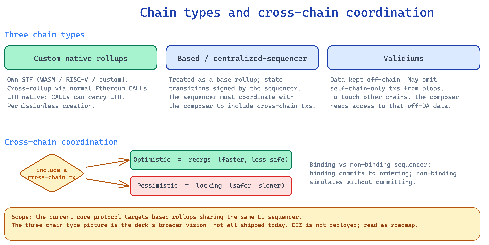

# Chain Types and Cross-Chain Coordination

*Explainer 4 of 7. Source: `knowledge/eez/sources/dappcon-2026-eez-node-architecture.md` (DAPPCon EEZ Workshop, 17 June 2026, Jordi Baylina). Engineering-level founding material. Quote as Jordi's framing, not as approved EEZ comms.*

The Ethereum Economic Zone is not one chain. It is an economic zone built on Ethereum, and it lets many rollups behave as one synchronous system. Different rollups are built in different ways. EEZ has to account for that. The DAPPCon deck names three chain types, and for each it sets out how that chain joins the zone and what it owes the rest of the system.

This explainer walks through the three types. It then covers the two methods for coordinating cross-chain inclusion, optimistic and pessimistic. It closes with the binding versus non-binding sequencer distinction from the node-architecture diagram, and how that ties back to coordination.

One framing note before the detail. EEZ is not deployed yet. The roadmap (deck slide 55) runs through smart-contract cleanup, an audit, the proving system, Composer 1.0, Chain Zero, and then connecting Gnosis Chain. So treat every "can a chain join" question as a roadmap question, not a "today" one. The mechanics below describe the design, not a live network.

> **Scope: vision versus shipped code.** The three chain types in this explainer (custom native rollups, based or centralized sequencer rollups, validiums) describe the DAPPCon deck's broader vision. The shipped implementation is narrower. The core-protocol repo (`eez-core-protocol`, branded "Sync Rollups") currently scopes synchronous composability to based rollups that share the same L1 sequencer. It pre-computes state transitions off-chain and verifies them on-chain, which enables atomic cross-rollup calls within a single L1 block. That code is explicitly early-stage and not audited. Do not assume all three chain types are implemented today. Read each type as a roadmap question, not a live capability.

## Chain type 1: custom native rollups

A custom native rollup brings its own state transition function. The deck is explicit that this function can run in WASM, in RISC-V, or in a custom format. The rollup defines its own rules and its own accepted proving systems. EEZ does not impose one execution model. Rollups are sovereign, governed by a rollup smart contract.

Cross-rollup interaction here is a normal Ethereum CALL and RETURN between smart contracts on different chains. A contract on chain 1 calls a contract on chain 2, and the result returns. This is not message passing and not a bridge. On L1, the participating contracts exist as proxies of their real counterparts on the rollup. The proxies are synchronous and they share state. That is the concrete form of "proxies, not bridges".

Inside a native rollup, the operations are execution entries, not transactions. Keep that distinction. "Transaction" is the right word for L1, and for partner chains that run their own transaction model, but not for the work happening inside an EEZ native rollup.

Native rollups that use ETH as their native asset can include ETH directly in CALLs. Moving ETH across rollups does not use a bridge. It uses rollup-level ETH accounting maintained in L1. The L1 layer keeps the books so the zone stays consistent.

Creation is permissionless. Anyone can create a native rollup and opt it in, and a rollup can opt out again. No committee gates entry.

On finality, native rollups follow the synchronous native path, which targets roughly 12 seconds, de facto in step with Ethereum. That is distinct from the async mode, which is not a slower settlement path but a cheaper read mode. An async static call reads against a possibly-outdated L1 block header, which is close to free because it stays on the L2; getting the latest current state instead means executing the call on Ethereum. Do not conflate the async read mode with a 20-minute finality figure. The roughly 12-to-20-minute number that appears elsewhere is the stall cost of a full-chain pessimistic lock, covered under coordination methods, not a finality path.

## Chain type 2: based and centralized sequencer rollups

The second type covers based rollups and centralized sequencer rollups. The deck treats any centralized rollup as a base rollup whose state transitions are all signed by the sequencer. The sequencer is the authority over what the chain includes and in what order.

This creates a coordination requirement. The L2 sequencer must coordinate with the composer to include cross-chain transactions. The composer is the component that builds and sends the batch to L1, and anyone can run one. For a self-contained chain the sequencer can act alone. The moment a transaction needs to touch another chain, the sequencer and the composer have to agree on inclusion, because the cross-chain effect has to land atomically with the rest of the zone.

The deck gives two methods for that coordination, optimistic and pessimistic. They are covered in their own section below, because they apply across chain types, not only to this one.

A practical note on terms. For these partner chains, "transaction" is acceptable, scoped to that chain's own model. The "execution entries" rule applies to EEZ native rollups, not to a based or centralized chain that already speaks in transactions.

## Chain type 3: validiums

A validium keeps its data off-chain rather than posting it all to blobs. The deck states that a validium may omit self-chain-only transactions from blobs. If a transaction only affects the validium itself, the validium does not have to publish it for the rest of the zone to function.

The condition is cross-chain reach. If a validium's transactions are to touch other chains, it must provide that information, or a coordination mechanism with composers, for the cross-chain part. The composer cannot reason about a cross-chain effect it cannot see. So the validium has to expose enough, either the data itself or an agreed mechanism, for the cross-chain interaction to be included and proven. Self-contained work can stay private to the validium. Anything that reaches out has to be visible to the coordination layer.

This keeps the validium's data-availability savings for its own internal activity, while still letting it join cross-chain flows when it chooses to. As with native rollups, joining is the chain's choice, and EEZ does not force a single data model on every participant.

In the DAPPCon talk Jordi made the access split precise. To rebuild a validium's full state you need extra data from sources outside the blobs, which is the validium's own data-availability arrangement. To route calls to or from the validium, the composer needs access to that data, because it has to see the cross-chain effect to include it. Other chains connecting to the validium do not need the full validium state. They only need the interactions recorded in the blobs, the calls and returns that actually cross the boundary. So the heavier data requirement falls on the composer that connects the validium, not on every chain in the zone.

## Chain type 4: non-EVM and specialized state transition functions

Jordi was explicit in the workshop that a joining chain does not have to be EVM at all. Because a native rollup brings its own state transition function, that function can be anything. He named privacy chains as the example, a Zcash-like design or a privacy-pool model, and also EVM plus custom precompiles. His framing was "a way of extending Ethereum in your own way". The zone does not require a single execution model. A chain can run a specialized STF, keep its own semantics, and still join cross-chain flows through the same proxy and coordination machinery as the other types. This is the open end of the chain-type list: the deck's named categories are not a closed set, and a sufficiently different STF is welcome as long as it meets the same cross-chain visibility and proving obligations.

## Coordination methods: optimistic and pessimistic

Cross-chain inclusion needs a way to keep the participating chains consistent while a cross-chain interaction is being assembled and proven. The deck names two methods. They sit on a liveness-versus-safety trade-off, and neither is universally better.

### Optimistic: reorgs

The optimistic method proceeds on the assumption that the cross-chain transaction will be included as planned, and it relies on reorgs to clean up if that assumption breaks. The chain keeps producing blocks. If the cross-chain interaction ends up not landing the way it was assumed, the affected portion is reorged out and rebuilt.

The benefit is liveness and lower latency. The chain does not stall waiting for confirmation from elsewhere. It keeps moving. The cost is that recently produced blocks are not safe until the cross-chain assumption settles. A reorg can undo work. The dependency also runs the other way: because a sync block commits to a specific Ethereum block, an Ethereum reorg forces the L2 to reorg its corresponding sync and async blocks to stay in step. The L2's optimistic blocks inherit Ethereum's reorg risk. This method fits chains and applications that value continuous progress and can tolerate that recent blocks may be revised. It is the looser, faster option.

### Pessimistic: locking

The pessimistic method locks before it proceeds. It does not assume inclusion will succeed. It secures the relevant state so that the cross-chain interaction either completes or fails cleanly, without a reorg. The deck adds an important qualifier. The lock is not necessarily the full chain. The system can lock only the part that the cross-chain interaction touches, rather than freezing everything.

The benefit is safety. There is no reorg risk on the locked state, because nothing conflicting can be produced while the lock holds. The cost is liveness and latency. Locked state cannot make independent progress until the lock clears, and acquiring the lock adds delay. Locking the full chain is the inefficient extreme. Jordi put the cost of a full-chain lock at roughly 12 to 20 minutes of stall, because the chain has to send to L1 and wait there before it can release. That figure is the price of the pessimistic full-chain lock, not a finality "path". Scoping the lock to only the affected state is what makes the method usable. This method fits high-value or hard-to-reverse interactions where a reorg would be unacceptable. It is the stricter, slower option, made more usable by the fact that the lock can be scoped to only the affected state.

### Choosing between them

The choice is the classic one. Optimistic favours liveness and latency and accepts reorg risk. Pessimistic favours safety and accepts added latency and reduced liveness on the locked state. A chain that prizes uninterrupted block production leans optimistic. A chain handling interactions that must never be reversed leans pessimistic. Because locking can be partial, a chain can also mix the two, using pessimistic locking only on the sensitive paths and staying optimistic elsewhere. The deck presents both as intended methods, so this is a design choice for the participating chain, not a single mandated rule.

## Binding versus non-binding sequencers

The node-architecture diagram (Jordi's hand-drawn topology) shows two deployment modes for how a sequencer relates to a composer. The distinction matters because it sets how strong the cross-chain guarantee is.

In non-binding mode, the diagram shows a composer with a simulator and a "sequencer not binding", stacked across several rollups. The composer simulates and proposes, but the sequencer has not committed to the exact cross-chain ordering in advance. The expert review in the source is direct about the effect. Non-binding degrades same-block atomicity to "same-batch, eventually". The cross-chain interaction still resolves, but not with the tight same-block guarantee.

In binding mode, the diagram shows separate composer instances, each paired with a "sequencer binding", feeding sequenced chains. Here the sequencer commits to the composer's cross-chain inclusion. That commitment is what supports the stronger, same-block atomic behaviour, because the sequencer is bound to the ordering the composer assembled.

This connects straight back to the coordination methods and to chain type 2. A binding sequencer commits up front, which pairs naturally with the pessimistic, lock-and-commit style where the goal is no reorgs and a firm guarantee. A non-binding sequencer keeps producing and lets the composer simulate and propose, which pairs with the optimistic style where reorgs are the cleanup tool and liveness comes first. The based and centralized sequencer rollup type is exactly where this shows up, because that is where the L2 sequencer must coordinate with the composer to include cross-chain transactions in the first place.

There is an honest cost to name. Binding mode asks the sequencer for a commitment, and the deck states that fee incentives for composers are not yet defined. The source notes that rational operators may default to non-binding or optimistic in quiet periods, when cross-chain revenue is thin. So the binding, pessimistic end of the design buys stronger guarantees, and the system still has to make running it worthwhile. That economic question is open, and it is roadmap work, not a settled answer.

## Accuracy notes

- EEZ is not deployed yet. The roadmap ends with Composer 1.0, Chain Zero, and connecting Gnosis Chain (deck slide 55). Frame any participation question as a roadmap question, not a "today" one.
- The synchronous native path targets roughly 12 seconds, de facto in step with Ethereum. "Async" is a read mode, not a finality path: an async static call reads a possibly-outdated L1 header cheaply on the L2, while the latest state requires executing on Ethereum. The roughly 12-to-20-minute figure is the stall cost of a full-chain pessimistic lock, not a settlement path. Do not conflate the two.
- EEZ is an economic zone built on Ethereum, not "an L2". Native rollups are an L2 construction that EEZ builds on top of.
- Cross-chain interaction uses proxies, not bridges. Proxies are synchronous and share state. Cross-rollup ETH movement uses rollup-level ETH accounting in L1, not a bridge.
- Inside EEZ native rollups, the operations are execution entries, not transactions. "Transaction" is acceptable for L1 and for partner chains (based, centralized sequencer, validium) that run their own transaction model, scoped to them.
- EEZ is proof-system agnostic and multi-prover-capable. Each rollup sets its own threshold via its manager contract, an M-of-N choice that can be one or more proving systems. There is no protocol-enforced minimum of two. The single `prover` box in the node-architecture diagram is a topology abstraction, not a single-prover claim. Do not use singular proving framing for EEZ as a whole.
- The two coordination methods (optimistic = reorgs, pessimistic = locking) and the binding versus non-binding distinction are Jordi's engineering-level framing from the DAPPCon workshop, not approved EEZ comms.
- Composer fee incentives are undefined in the deck. The non-binding-default risk in quiet periods is an open design area, flagged as roadmap work.
