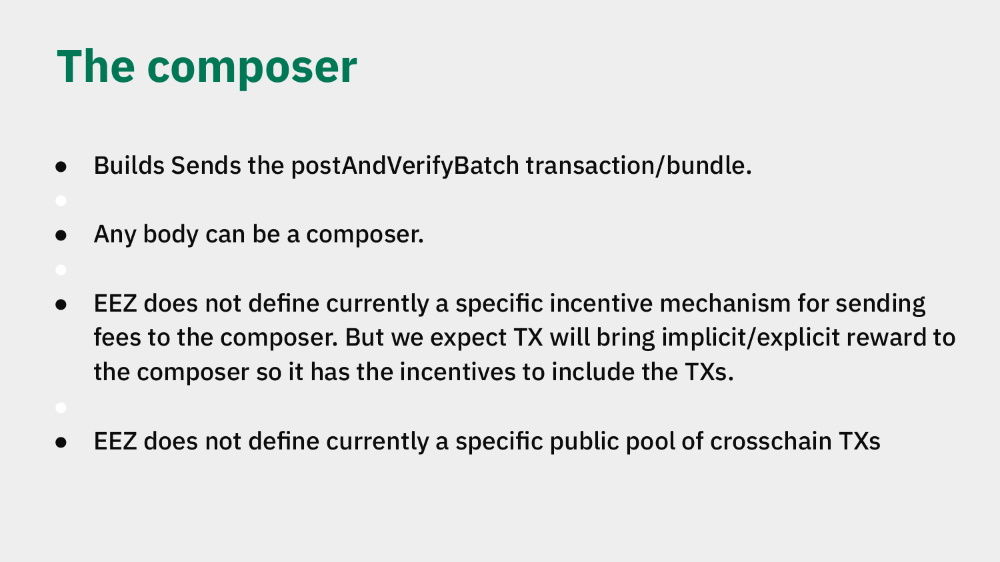

# The Composer

*Explainer 5 of 8. [Series index](README.md). Status, sourcing and caveats: [Conventions & Caveats](00-conventions-and-caveats.md).*

The [EEZ](GLOSSARY.md) proves the combined execution of many rollups as a single, synchronous run. The [composer](GLOSSARY.md) is the piece of node software that pulls that off. This explainer covers what the composer does, why anyone can run one, the parts inside it, and the design questions the deck leaves open.

The composer described here is the first version. The design intent reflects what is settled "at least in this first version", with several economic questions left open (see status in [Conventions & Caveats](00-conventions-and-caveats.md)).

---

## What the composer does

The composer builds and sends the [`postAndVerifyBatch`](GLOSSARY.md) transaction. That is its job in one sentence.

In more detail, it takes the last n blocks across the rollups it serves and creates a `postBatch` payload, then submits that payload first to the [provers](GLOSSARY.md) and next to L1 through an L1 Builder. The deck calls this step "propose settlement".

*From Jordi's DAPPCon deck (slide 9): the composer.*

The order matters. The composer never sends anything to L1 raw. It assembles a bundle, the provers do their work on it, and only then does the bundle reach L1. The composer streams helper data to the provers so they can start early, keeping the whole pipeline inside an L1 slot (timing model: [Conventions & Caveats](00-conventions-and-caveats.md)).

In the shipped code the proving step is currently mocked (a mock ECDSA prover): the multi-prover types and structure are real, but the overlapped-streaming proving pipeline described here is design intent rather than running code. The real-time proving target is covered in [Explainer 7](07-real-time-proving-zisk.md).

The composer submits to provers, plural. The proof systems each rollup has configured, since the count is the rollup's choice and not a protocol minimum (see [Conventions & Caveats](00-conventions-and-caveats.md)). The work it settles is cross-chain interaction expressed as normal Ethereum CALL and RETURN between contracts on different rollups, recorded in the [EEZ Trace](GLOSSARY.md) blob format.

---

## How the composer lands a cross-chain call on L1

Phillipe Schommers' Dappcon talk makes the on-L1 mechanism concrete. It is worth spelling out, because Ethereum cannot pause execution mid-transaction to wait for another chain. Say a contract A on Ethereum calls B-star, the [proxy](GLOSSARY.md) for contract B on Gnosis Chain, and B returns 42. On a normal chain you cannot stop A, go run B, and come back. The composer works ahead of the user.

The composer simulates both chains together and produces the [execution tables](GLOSSARY.md) (the EEZ Trace) for the call and its return. Then it seeds the result on L1 before the user's transaction runs: it inserts into the EEZ contracts a statement that, in this specific state, a call from A to B-star returns 42. When the user's transaction then executes and B-star is called, B-star reads that pre-seeded answer from the EEZ contracts.

The seeded result and the user transaction travel together. The composer's `postAndVerifyBatch` carries the blobs, call data, state roots, and the execution tables, and the user's L1 transaction follows as an MEV-style bundle that an L1 builder executes, so both land atomically in one L1 block. The whole thing is valid for one specific block only: if the bundle is not included (for example because it did not pay enough gas) it reverts, and the synchronous call simply does not happen.

The cleaner user route is account abstraction: bundle the whole sequence into a single transaction that uses transient storage instead of real storage. The recording puts this at roughly 10x cheaper than the full real-storage path, and the user pays only if the transaction does not revert.

This is also why a cross-chain transaction cannot use the public L1 mempool. If a user sends a cross-chain L1 transaction to the public mempool, an ordinary Ethereum validator can pick it up and include it before the composer has seeded the state. The B-star call then reverts, because the answer was never written. This is not malicious front-running by the composer. It is an ordering requirement: the seeded state has to be in place before the call runs, so the orderflow has to reach the composer before it hits L1, via the composer bundle or account abstraction. What the cross-chain pool that collects this orderflow looks like is explicitly left undefined at this stage (see open questions below).

---

## Anybody can be a composer

The composer is permissionless. The deck states it plainly: anybody can be a composer.

This is the same open-participation principle that runs through the rest of EEZ. The EEZ smart contract is permissionless, rollups opt in and out freely, and rollup creation is permissionless. The composer follows the pattern: no allowlist, no committee, no gate to clear before you build and propose a batch.

Permissionless does not mean simple. A composer has to track cross-chain state, coordinate with [sequencers](GLOSSARY.md) where coordination is required, build a valid bundle, stream data to provers, and get the result onto L1 through a builder. That is real engineering work. The protocol just does not decide who is allowed to do it.

Because anyone can run one, several composers can operate at once. The deck describes a binding mode with multiple composer instances, each paired with a [binding sequencer](GLOSSARY.md), and a non-binding mode where a composer runs a simulator alongside a sequencer that does not bind. Coordination across many composers is one of the open questions, covered below.

---

## Inside the composer

The deck's architecture diagram shows the composer as a binary with several parts. The provers and the L1 Builder sit outside the binary: the provers read L1 and take the `postBatch` data plus optional helper data (streamed so they can start early), and the L1 Builder is what actually lands the bundle on L1.

| Component | Role |
|---|---|
| **Orchestrator** | The coordinating core. Drives the other parts and decides when to propose a settlement. Receives `proposeBlock`; on the output side, submits the bundle to the L1 Builder. |
| **L1 EL client (+ inspector)** | The composer's own L1 execution-layer client, with a nested inspector. The settlement it builds depends on a current view of L1 state. The proxy state on L1 is part of what the proof commits to, so it cannot build a final bundle without reading L1. |
| **Crosschain mempool** | Holds cross-chain items, both L1 and L2 sides. This is the working set for assembling a cross-chain batch and the composer's own mempool; the protocol defines no shared public pool (see open questions below). |
| **L2 mempool** | A separate pool for L2-only items: work that stays inside a single rollup and does not touch another chain. |
| **Propose settlement** | The output step: take the last n blocks, create the `postBatch` payload, send it to the provers first, then to L1 via the L1 Builder. The user-facing bundle is up to three transactions (deploy the proxy if it does not exist yet, load the lookup table, then the user transaction) with the composer/proof transaction landing first and the user transaction second. |

---

## The open questions: incentives and the cross-chain pool

This is the part to be honest about. The economics around the composer are not settled. The deck says so directly, and this document will not pretend otherwise.

**There is no defined incentive mechanism for routing fees to the composer in this first version.** EEZ does not currently define how a composer gets paid for its work, while acknowledging that some mechanism is necessary. Candidates raised include fees, higher fees, private orderflow, and L2 fees. The deck's expectation is that transactions carry an implicit or explicit reward, giving a composer a reason to include them. That is an expectation, not a mechanism. It is left to the transactions themselves rather than fixed by the protocol. Whether that produces reliable composer behaviour is an open question. A composer in binding mode commits to work, but cross-chain fee revenue is irregular, so a rational operator might default to the non-binding or optimistic path in quiet periods. The deck names composer fee incentives as roadmap work, not a solved problem.

**There is no defined public pool of cross-chain transactions.** EEZ does not currently define a shared, protocol-level pool that all composers draw from. Each composer has its own crosschain mempool, as the diagram shows. Without a common pool, coordinating which composer handles which cross-chain item is an open design area. The deck confirms this is acknowledged design space, not an oversight. Based and centralised-sequencer rollups have to coordinate with composers through one of two methods: [optimistic](GLOSSARY.md), which allows reorgs, or pessimistic, which uses locking (and not necessarily of the full chain). How that coordination scales across many independent composers is not yet specified.

Put plainly, the protocol defines what a composer does and lets anyone do it, but it does not yet define how composers get paid or how they avoid stepping on each other. Both are listed as open work. A builder reading this should treat the incentive layer as a question to watch, not a feature to plan around.

---

*Source: `knowledge/eez/sources/dappcon-2026-eez-node-architecture.md` (DAPPCon 2026 EEZ Workshop, Jordi Baylina, 17 June 2026); on-L1 seeding and orderflow routing from `knowledge/eez/sources/dappcon-2026-gnosis-chain-eez-talk.md` (Phillipe Schommers).*
