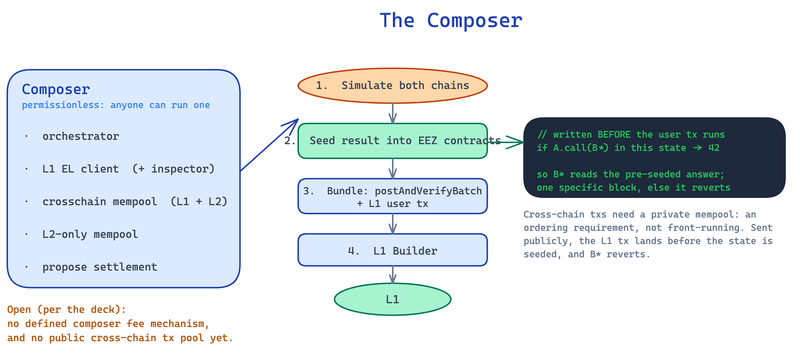

# The Composer

*Explainer 5 of 8. Sources: `knowledge/eez/sources/dappcon-2026-eez-node-architecture.md` (DAPPCon 2026 EEZ Workshop, Jordi Baylina, 17 June 2026) and `knowledge/eez/sources/dappcon-2026-gnosis-chain-eez-talk.md` (Phillipe Schommers, the on-L1 seeding mechanism and private mempool). Treat as engineering-level founding material, not approved EEZ comms.*

The Ethereum Economic Zone (EEZ) is an economic zone built on Ethereum. It proves the combined execution of many rollups as a single, synchronous run. The composer is the piece of node software that pulls that off. This explainer covers what the composer does, why anyone can run one, the parts inside it, and the design questions the deck leaves open.

Before going further, one status note. EEZ is not deployed yet. The composer described here is "Composer 1.0", a named milestone on the roadmap (item 6 of 8 on slide 55). Nothing in this document means you can run a composer today. This is the design, not a live system.

---

## What the composer does

The composer builds and sends the `postAndVerifyBatch` transaction. That is its job in one sentence.

In more detail, the composer takes the last n blocks across the rollups it serves and creates a `postBatch` payload. It submits that payload first to the provers and then to L1 through an L1 Builder. The deck describes this step as "propose settlement": take the last n blocks and create the `postBatch` payload submitted first to the prover and next on L1.

The order matters. The composer does not send anything to L1 raw. It assembles a bundle, the provers do their work on it, and only then does the bundle reach L1. The composer streams helper data to the provers so they can start early, which keeps the whole pipeline inside an L1 slot. The deck targets overlapped bundle building and proof building at under three seconds in total.

A few accuracy points sit underneath this. The composer submits to provers, plural. It submits proofs from the proving systems each rollup has configured. EEZ is proof-system agnostic, so every rollup chooses its own systems and its own threshold. The count is the rollup's configuration, not a fixed minimum set by the protocol. The architecture diagram draws a single `prover` box, but that is a topology abstraction. Do not read it as a single prover. The work the composer settles is cross-chain interaction expressed as normal Ethereum CALL and RETURN between contracts on different rollups, recorded in the EEZ Trace blob format. Inside a native rollup these operations are execution entries, not transactions. The L1 layer and partner chains keep their own transaction model.

---

## How the composer lands a cross-chain call on L1

Phillipe Schommers' Dappcon talk makes the on-L1 mechanism concrete, and it is worth spelling out, because Ethereum cannot pause execution mid-transaction to wait for another chain. Say a contract A on Ethereum calls B-star, the proxy for contract B on Gnosis Chain, and B returns 42. On a normal chain you cannot stop A, go run B, and come back. So the composer works ahead of the user.

The composer simulates both chains together and produces the execution tables (the EEZ Trace) for the call and its return. Then it seeds the result on L1 before the user's transaction runs: it inserts into the EEZ contracts a statement that, in this specific state, a call from A to B-star returns 42. When the user's transaction then executes and B-star is called, B-star reads that pre-seeded answer from the EEZ contracts. The seeded result and the user transaction travel together. The composer's `postAndVerifyBatch` carries the blobs, call data, state roots, and the execution tables, and the user's L1 transaction follows as an MEV-style bundle that an L1 builder executes. The whole thing is valid for one specific block only. If the bundle is not included, for example because it did not pay enough gas, it reverts, and the synchronous call simply does not happen.

This is also why cross-chain transactions want a private mempool. If a user sends a cross-chain L1 transaction to the public mempool, an ordinary Ethereum validator can pick it up and include it before the composer has seeded the state. The B-star call then reverts, because the answer was never written. This is not malicious front-running by the composer. It is an ordering requirement: the seeded state has to be in place before the call runs, so the orderflow needs to reach the composer first.

---

## Anybody can be a composer

The composer is permissionless. The deck states it plainly. Anybody can be a composer.

This is the same open-participation principle that runs through the rest of EEZ. The EEZ smart contract is permissionless. Rollups opt in and opt out freely. Rollup creation is permissionless. The composer follows the pattern. There is no allowlist, no committee, no gate to clear before you build and propose a batch.

Permissionless does not mean simple. A composer has to track cross-chain state, coordinate with sequencers where coordination is required, build a valid bundle, stream data to provers, and get the result onto L1 through a builder. That is real engineering work. But the protocol does not decide who is allowed to do it. Anyone who can run the software can run a composer.

Because anyone can run one, several composers can operate at once. The deck describes a binding mode with multiple composer instances, each paired with a binding sequencer, and a non-binding mode where a composer runs a simulator alongside a sequencer that does not bind. Coordination across many composers is one of the open questions, covered below.

---

## Inside the composer

The architecture diagram (the hand-drawn "Martin's Draw") shows the composer as a binary with several parts. Here is what each one does, as far as the diagram and deck describe it.

**Orchestrator.** The coordinating core of the composer. It drives the other parts and decides when to propose a settlement. The diagram shows the composer receiving `proposeBlock` and, on the output side, submitting the bundle to the L1 Builder.

**L1 EL client, with an inspector.** The composer runs its own L1 execution-layer client and reads L1 through it. Nested inside is an inspector. The composer needs an accurate, current view of L1 state because the settlement it builds depends on it. The proxy state on L1 is part of what the proof commits to, so the composer cannot build a final bundle without reading L1.

**Crosschain mempool (L1 and L2 tx).** A pool that holds cross-chain items, both L1 and L2 sides. This is the working set the composer draws from when it assembles a cross-chain batch. Note that this is the composer's own mempool. The protocol does not define a shared public pool of cross-chain transactions. More on that below.

**L2 mempool (mem-Pool, L2 only).** A separate pool for L2-only items, the work that stays inside a single rollup and does not touch another chain.

**Propose settlement.** The output step described above. The composer takes the last n blocks and creates the `postBatch` payload, sends it to the provers first, then to L1 through the L1 Builder. The final flow on the diagram is the composer submitting the bundle, `(postBatch)(L1 user tx)`, to the L1 Builder, which posts to L1.

The provers and the L1 Builder sit outside the composer binary. The provers read L1 and take the `postBatch` data plus optional helper data, streamed so they can start early. The L1 Builder is the component that actually lands the bundle on L1.

---

## The open questions: incentives and the cross-chain pool

This is the part to be honest about. The economics around the composer are not settled. The deck says so directly, and this document will not pretend otherwise.

**There is no defined incentive mechanism for routing fees to the composer.** EEZ does not currently define how a composer gets paid for its work. The deck's expectation is that transactions carry an implicit or explicit reward, so a composer has a reason to include them. That is an expectation, not a mechanism. It is left to the transactions themselves rather than fixed by the protocol. Whether that produces reliable composer behaviour is an open question. A composer in binding mode commits to work, but cross-chain fee revenue is irregular, so a rational operator might default to the non-binding or optimistic path in quiet periods. The deck names composer fee incentives as roadmap work, not a solved problem.

**There is no defined public pool of cross-chain transactions.** EEZ does not currently define a shared, protocol-level pool that all composers draw from. Each composer has its own crosschain mempool, as the diagram shows. Without a common pool, coordinating which composer handles which cross-chain item is an open design area. The deck confirms this is acknowledged design space, not an oversight. Based and centralised-sequencer rollups have to coordinate with composers through one of two methods, optimistic which allows reorgs, or pessimistic which uses locking and not necessarily of the full chain. How that coordination scales across many independent composers is not yet specified.

Put plainly, the protocol defines what a composer does and lets anyone do it, but it does not yet define how composers get paid or how they avoid stepping on each other. Both are listed as open work. A builder reading this should treat the incentive layer as a question to watch, not a feature to plan around.

---

## Accuracy notes

- **EEZ is not deployed.** The composer here is "Composer 1.0", roadmap item 6 of 8 (DAPPCon deck slide 55). No one can run a composer today.
- **Provers are plural.** EEZ is proof-system agnostic and multi-prover-capable. Each rollup sets its own threshold (one or more) through its manager. There is no protocol-enforced minimum of two. The single `prover` box on the diagram is a topology abstraction, not a single-prover claim.
- **Proxies, not bridges.** EEZ cross-chain interaction uses proxies on L1, which are synchronous and share state. It is not a bridge and not message passing. It is a normal Ethereum CALL and RETURN.
- **Execution entries, not transactions.** Operations inside an EEZ native rollup are execution entries. "Transaction" is used only for the L1 layer (for example the `postAndVerifyBatch` transaction and L1 user tx) and for partner chains' own models.
- **Async ~20min vs native ~12s.** No single finality figure applies to EEZ as a whole. The async path settles in about 20 minutes. Native rollups settle in about 12 seconds. This document does not attach a finality number to the composer itself, because settlement timing depends on the path.
- **Economic zone, not an L2.** EEZ is an economic zone built on Ethereum, not an L2. Native rollups are an L2 construction that EEZ is built on top of.
- **Incentives are unsettled, stated as such.** The "no fee mechanism" and "no public cross-chain pool" points come straight from the deck and are presented as open problems, not solved design.
- Source for all claims: `knowledge/eez/sources/dappcon-2026-eez-node-architecture.md`.
