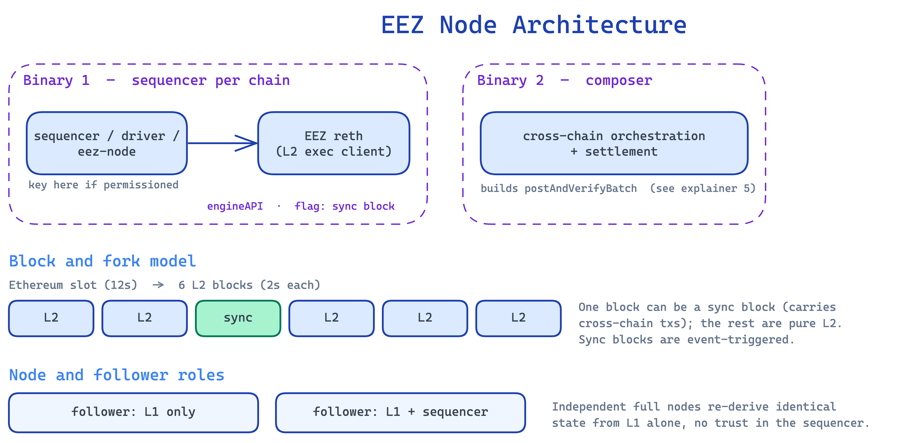

# EEZ Node Architecture: The Two Binaries and the Block Model

*Explainer 6 of 8. [Series index](README.md). Status, sourcing and caveats: [Conventions & Caveats](00-conventions-and-caveats.md).*

This explainer is for builders and partners who want to understand the node software behind [EEZ](GLOSSARY.md). It walks through the two binaries that run a participating chain, the block and fork model that governs when cross-chain work happens, the follower roles, and the two deployment modes. It also names, honestly, the parts the diagram leaves open. The node software described here is what an operator runs to take part in the zone.

## The two binaries

Jordi's diagram splits the node software into two separate binaries. They run on different timescales and have different jobs, so keeping them apart is a useful separation-of-concerns model, not an accident of drawing.

A note on shipped reality: the two-binary framing describes the deck's architecture diagram. In the shipped eez-rollup0 the sequencer and composer are compiled into a single `eez-node` binary and selected by a runtime mode (standalone / follower / composer). The conceptual split below still holds as a way to reason about scope and failure domains; it just maps onto one mode-switched binary in practice rather than two separate executables.

### Binary 1: the sequencer, per chain

There is one instance of Binary 1 per chain. It produces that chain's blocks and nothing else. Inside it sit three named parts, `sequencer`, `driver`, and `eez-node`, plus the execution client they drive.

The [sequencer](GLOSSARY.md) orders the chain's work and decides what goes into the next block. The diagram notes here: "if permissioned, the key is here." When a chain runs with a permissioned sequencer, the signing key that authorises its blocks lives inside this process. That makes the key location explicit, and it also makes the single sequencer a single point of liveness, which we return to under the open gaps.

The `eez-node` and `driver` talk to the execution client over the Engine API. The execution client is EEZ reth, a reth-based L2 execution client. The diagram also marks a "sync block" flag on this link: how the node signals that the block it is asking for is a [sync block](GLOSSARY.md) rather than an ordinary block. Its precise semantics are an EEZ reth protocol change the diagram does not fully specify. That is flagged under open gaps.

**For builders:** the Engine API link carries two named calls. `builtBlock` returns a block the execution client has assembled; `forkChoiceUpdate` tells it which head to build on. These are the diagram's labels for the assembled-block and fork-choice exchange, not literal Engine API method names. The real Engine API names these `engine_getPayloadV*`, `engine_forkchoiceUpdatedV*`, and so on.

So Binary 1, read top to bottom, is: the sequencer decides and (if permissioned) signs, the driver and eez-node drive the Engine API, and EEZ reth executes and stores the chain's state.

### Binary 2: the composer

Binary 2 is the [composer](GLOSSARY.md). It handles cross-chain orchestration and settlement and is the subject of [its own explainer](05-the-composer.md), so we summarise here and cross-reference.

In short, the composer runs an `orchestrator`, an L1 execution-layer client with a nested `inspector`, a cross-chain mempool that holds both L1 and L2 transactions, an L2-only mempool, and a "propose settlement" step. That step takes the last few blocks and builds the `postBatch` payload, which it submits first to the proving pipeline and then to L1. (`postBatch` is the diagram's informal label for the same call that [Explainer 5](05-the-composer.md) and the contracts name `postAndVerifyBatch`, so cross-referencing readers are looking at one function, not two.) The composer is permissionless: anybody can run one.

The composer is a separate binary because its work spans all participating chains and the L1, whereas Binary 1 only ever knows its own chain plus L1. The two have genuinely different scopes and failure domains.

## The block and fork model

The top of the diagram is a timeline. L1 advances `L1-100 → L1-101 → L1-102` with normal L1 block propagation. Below it, each EEZ chain produces its own blocks, and those blocks come in three kinds.

### Async blocks, sync blocks, and L1-hash-update blocks

Most blocks on an EEZ chain are [async blocks](GLOSSARY.md): work that touches only its own chain (L2-only), produced on the chain's own schedule without coordination. Because they are sequencer-controlled and never tied to a particular L1 block, they never need to reorg. A [sync block](GLOSSARY.md) is the unit that carries a cross-chain interaction that must resolve atomically with work on another chain; it carries a strong commitment to a specific Ethereum block and reorgs if that Ethereum block reorgs. The third kind is an **L1-hash-update block**, which pushes the latest L1 state root onto the L2 so contracts can do cheap static reads against fresh Ethereum state without executing a live L1 call. The team wants that Ethereum state root on the L2 as soon as possible, since static reads against it cost roughly pure-L2 gas.

The diagram shows `sync block 1` and `sync block 2` on EEZ chain 1. Building a sync block has a timing constraint: roughly ~4 seconds before the next L1 block, the sequencer must commit to the cross-chain step, "time-travelling" by assuming the incoming L1 call and its return values, then confirming once the L1 block propagates.

The native path and the async path settle on different timelines, and there is no single finality number for EEZ as a whole. See the [canonical timing model](00-conventions-and-caveats.md#canonical-timing-model) for the figures and always name the path beside any one of them.

### Sync blocks are event-triggered

The single most important note in this part of the diagram is short: sync blocks are "only needed if L1↔L2 tx pending." A chain does not produce a steady stream of them. It produces one only when there is a pending L1↔L2 interaction that needs the atomic, coordinated treatment. The rest of the time the chain produces async blocks and runs on its own.

This matters for cost and coordination: the overhead is paid only when a cross-chain interaction is actually in flight. Quiet chains stay cheap.

### How the chain behaves while a sync block resolves

While a sync block is being assembled, the chain has to decide what to do with the ~4-second window before the L1 block lands and confirms it. There are two approaches, and it matters which one is shipped today.

The **current first implementation is the naive one: it pauses the chain** until the cross-chain step resolves ("we pause the chain until it's resolved"). Nothing else is produced in that window. With Gnosis-scale traffic (only ~100–150 bridge transactions per day) a sync block is needed only every couple of minutes, so the naive pause is tolerable to start with.

The **planned optimization is the "chain split."** Instead of pausing, the chain would keep building L2-only, state-independent transactions (e.g. token transfers) and give confirmations during the window, while holding the fork-dependent work against the cross-chain outcome. In that model the diagram tags transactions two ways: a transaction **independent of the fork** does not care which way the pending cross-chain decision resolves and can be included regardless, while a transaction **dependent of the fork** is tied to the outcome of the cross-chain step the sync block is resolving. The "unused blocks" in the diagram are the branches of that split that do not end up on the final chain once the outcome is known. This chain-split behaviour is design intent, not shipped today.

## Node and follower roles

Not every participant produces blocks. The diagram distinguishes two follower roles by what they read, and that determines what each can verify.

| Role | Reads | Can verify |
|---|---|---|
| `follower L1 only` | L1 only | Everything settled and proven on L1 (`postBatch` results and proven cross-chain outcomes once they land). Cannot reconstruct an individual L2's full internal state (that L2 is drawn dashed: derived, not directly observed). |
| `follower L1 + sequencer` | L1 + one chosen L2 | Everything the L1-only role can, plus the full state of the L2 it follows, rebuilt from L1 plus that one chain with no other L2 sync required. |

Takeaway: verification scales with the data you read. Neither role requires syncing every chain in the zone.

## Deployment modes: binding and non-binding

The bottom of the diagram shows two ways to deploy, mapping onto two chain types. See the [glossary entry](GLOSSARY.md) for the core distinction.

| Mode | Sequencer | Maps to | Trade-off |
|---|---|---|---|
| **Non-binding** | runs with a `simulator`; sequencer "not binding," replicable across several chains; composer simulates and chains follow with no hard pre-commitment | rollups | More flexible, but degrades same-block atomicity to "same-batch, eventually" |
| **Binding** | sequencer "binding" and committed up front; diagram shows three composer instances feeding sequenced chains | sequenced ([centralised-sequencer](GLOSSARY.md)) chains | Stronger atomicity from the up-front commitment, at the cost of requiring it |

Shipped reality: the eez-rollup0 code implements only the non-binding/optimistic path today; binding mode is design intent, not yet running.

The deck's chain-types material lines up with this. A centralised-sequencer rollup is treated as a base rollup whose state transitions are signed by the sequencer, and that sequencer must coordinate with the composer to include cross-chain transactions. The deck names two [coordination methods](04-chain-types-and-coordination.md): optimistic (allows reorgs) and pessimistic (locking that need not lock the whole chain). Those two methods are the design intent behind the diagram's "chain split."

## Known open gaps

The diagram is a correct topology sketch, not a finished specification. Several things are genuinely open, and the honest position is to name them. The deck answers some of them at the level of intent without giving a full protocol.

**Reorg and cancellation protocol.** The baseline reorg rule is already known: sync (and async-with-L1) blocks carry a strong commitment to their Ethereum block and reorg if that Ethereum block reorgs, while L2-only blocks are sequencer-controlled and never need to reorg. On top of that, the deck gives the two intended coordination methods (optimistic reorgs, pessimistic locking), which is the design intent behind the chain split. What is genuinely still open is a per-step cancellation protocol for an in-flight proving run once an L1 reorg invalidates a sync block. That is roadmap work, not a solved problem.

**Multi-composer coordination.** Anybody can run a composer, and the deck confirms there is no protocol-defined public pool of cross-chain transactions yet. So how multiple composers coordinate, especially in binding mode, is an explicitly open design area rather than an oversight.

**Engine API sync-block flag semantics.** The sync-block flag on the Engine API link is a real EEZ reth protocol change. It needs a precise specification, and the diagram does not provide one.

**Single points of liveness.** There is one sequencer per chain, with its key in the process and no standby shown, and a single composer per binding deployment. The diagram does not show failover for either.

**Composer economics.** The deck states openly that fee incentives for composers are undefined **in this first version**. The team acknowledges an incentive is needed and named candidate mechanisms (fees, higher fees, private order flow, L2 fees) without committing to one. Binding mode requires commitment, but cross-chain fee revenue is irregular, so rational operators might default to non-binding or optimistic behaviour in quiet periods. This is a named open question, not a design that has been settled.

**Data availability dependence.** EEZ's blob-heavy design implies a dependence on Ethereum data availability: it puts a lot of information into blobs, so its own throughput is bounded by how much L1 blob capacity can carry. This is an external dependency on Ethereum scaling, not something EEZ resolves on its own.

One thing that is *not* an open gap, despite how the diagram looks. The single `prover` box is a topology abstraction, not a single-prover design. EEZ is proof-system agnostic and multi-prover-capable: each rollup sets its own threshold on its [manager contract](GLOSSARY.md), and the protocol does not force a minimum of two (see [Conventions & Caveats](00-conventions-and-caveats.md)). A rollup that wants stronger security configures two or more proving systems. That is the design intent.

EEZ is not live yet. The roadmap runs through smart-contract cleanup, documentation, a request for comments, an audit, the signature and ZisK proving systems, Composer 1.0, Chain Zero, and then connecting Gnosis Chain. The node architecture above is what operators are being built to run, not software you can run in production today.

---

*Source: `knowledge/eez/sources/dappcon-2026-eez-node-architecture.md` (DAPPCon EEZ Workshop, 17 June 2026, Jordi Baylina). Part 2 transcribes the hand-drawn node-software diagram ("Martin's Draw"), Part 3 carries the expert review.*
