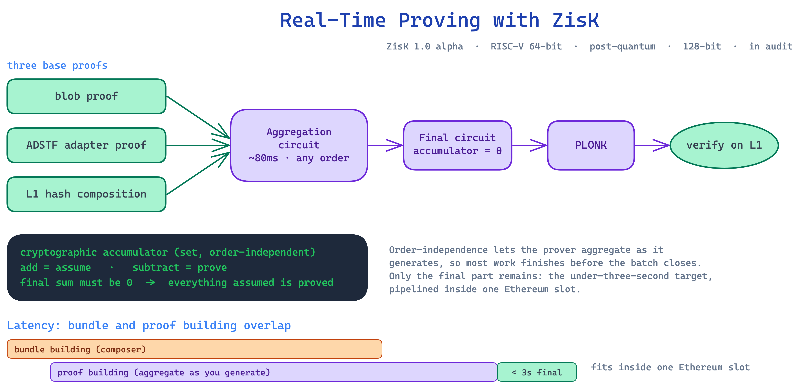

# Real-Time Proving with ZisK



*Sources: `knowledge/eez/sources/dappcon-2026-eez-node-architecture.md` (DAPPCon EEZ Workshop deck) and `knowledge/eez/sources/dappcon-2026-realtime-proving-talk.md` (Jordi Baylina's spoken talk, "Real-Time Proving and Synchronous Composability Between Rollups", DAPPCon Berlin, 16 June 2026). Co-branded Ethereum Economic Zone × ZisK VM. Engineering-level founding material. Quote as Jordi's framing, not as approved EEZ comms. EEZ is at roadmap stage and is not deployed yet. The ZisK proving system is itself a roadmap item, listed under "Signature and Zisk proving system" on the DAPPCon roadmap slide.*

This explainer is for builders and partners who want to understand how the Ethereum Economic Zone (EEZ) generates proofs fast enough to make synchronous cross-rollup execution work. It covers the Action-Driven State Transition Function (ADSTF), the EEZ Trace blob format, the recursion pipeline step by step, how each rollup configures its own proving systems and verification threshold, and why low proof-generation latency is the thing that makes a single synchronous cross-rollup step possible at all.

A status note on ZisK. The detailed status claims here — **ZisK 1.0 alpha** (code frozen and usable, kept at "alpha" because soundness is not yet fully confirmed), an open-source RISC-V 64-bit ZKVM designed to be post-quantum with 128-bit security, and a next phase of auditing and AI-assisted formal verification of the circuits — come from a separate ZisK session, not this BuilderRoom recording. The BuilderRoom recording does not corroborate them. Treat ZisK as early and moving, not finished.

One framing note before we start. The DAPPCon talk is branded around ZisK, so it is easy to read EEZ as a single-prover system. It is not. ZisK is one proving system among several EEZ supports. EEZ is proof-system agnostic, and each rollup chooses its own systems and threshold. Hold that point through the whole document. We return to it in the multi-prover section.

EEZ is an economic zone built on Ethereum. It is not an L2, and it is not equivalent to any single rollup. It is the shared proving and settlement layer that lets independent rollups call into each other inside one atomic step.

## The Action-Driven State Transition Function (ADSTF)

A note on the term before we begin. ADSTF is the deck's conceptual framing for the per-rollup state transition. The shipped contracts express this with execution entries, state deltas, and a rolling hash, not a type literally named ADSTF, so a reader checking the code will not find that label there. We keep ADSTF as the conceptual name throughout.

A normal state transition function takes a starting state and a block of transactions, and produces an ending state. EEZ needs more than that, because a rollup in EEZ does not run in isolation. It can be called by another rollup, and it can call out to another rollup, all inside the same proven step.

The ADSTF captures this. It runs like so:

```
ACTION IN  →  INITIAL STATE  →  ADSTF  →  FINAL STATE
                                       →  ACTION OUT
                                       →  REVERT INFO
```

Read the inputs and outputs as a single shape. The ADSTF takes an incoming action and the rollup's initial state. It produces three things. First, the final state of that rollup. Second, an outgoing action, which is the rollup's own CALL or RETURN to another chain. Third, revert information, which records what should be undone if any part of the combined step fails.

The action in and action out are how the function expresses cross-chain behaviour. Inside a native rollup, the work the function performs is made of execution entries, not transactions. The action in is a CALL or RETURN arriving from another chain. The action out is a CALL or RETURN this rollup sends to another chain. Because the function names both its inputs and its cross-chain effects explicitly, the proof can reason about cross-chain interaction directly, rather than treating it as an external side effect that happens somewhere off to the side.

The revert info matters for atomicity. A synchronous cross-rollup step either fully happens or fully unwinds. The ADSTF emits enough information at each step to reverse it, so a revert anywhere in the combined execution can roll the whole step back cleanly.

## The EEZ Trace blob format

The ADSTF describes what one rollup does. The EEZ Trace describes how the rollups hand control to each other.

The deck calls it "the blob format." It records each context switch between chains. A context switch is a CALL, where one chain hands execution to another, or a RETURN, where execution comes back. The trace records both directions. It also records reverts, so the unwinding of a failed step is part of the same record as the forward execution.

Think of the EEZ Trace as the authoritative log of the combined execution. It is not a per-chain log stitched together after the fact. It is one ordered record of every boundary crossing in the step. Chain 1 calls Chain 2. The trace records the switch. Chain 2 runs and returns. The trace records the switch back. If Chain 2 reverts, the trace records that too, alongside the revert info the ADSTF produced.

This single ordered record is what the proving pipeline proves over. The pipeline does not prove each chain on its own and hope the pieces fit. It proves that the whole trace, every context switch in order, is consistent and valid.

## The recursion pipeline, step by step

EEZ proves the combined execution through a chain of recursive circuits. Each circuit verifies the output of the one before it, so the final proof stands in for all the work underneath it. This is genuinely sequential, so a numbered walk-through is the clearest way to read it.

1. **ADSTF Adaptor.** This is the entry point. Each rollup defines its own state transition function and supplies a circuit for it. The ADSTF Adaptor verifies a user-defined circuit verification key (VK). In plain terms, it checks that the rollup ran the state transition function the rollup itself committed to, and nothing else. Because rollups are sovereign and define their own rules and their own accepted proving systems, this adaptor step is where each rollup's own choices get checked against its own declared VK.

   The adaptor does this with one level of recursion: it recursively verifies the rollup's own circuit against the VK configured in the smart contract, then folds the result into the full proof. Jordi calls this the key trick, because it lets EEZ prove state transitions for rollups whose function is not defined yet. A rollup that joins next year brings its own circuit and its own VK. The VK is not fixed in the protocol: it is supplied by the rollup's own manager contract at proving time, and it can change (via the rollup's governance, DAO, or owner). The adaptor handles the rest, so new rollups can join without the protocol pre-committing to anything about their internals.

2. **L1 Hash Builder.** This circuit ties the proof to L1. It handles the blob commitment, so the data the proof covers is the data actually posted. It records the starting and ending blob rollup state, so the step has a defined before and after on L1. It captures the L1 interactions for the step. And it carries the mapping from each RollupId to the proof system and VK that rollup uses. This mapping is the bridge between the abstract proof and each rollup's own in-contract configuration of which proving systems it allows, which we cover in the next section.

3. **Aggregation Circuit.** This circuit verifies two proofs at once and adds their accumulators together. The accumulator is the mechanism that makes the whole pipeline work, so it is worth understanding. It is hash-like but order-independent: combining two elements gives the same result whichever order you combine them in, the way a set ignores order. Each proof adds elements to the accumulator when it assumes something, and subtracts elements when it proves that assumption. Parsing a blob, for example, assumes each rollup's state transition function is correct (it adds it); the ADSTF Adaptor then proves that function (it subtracts it). Aggregating two proofs is just adding their accumulators. Because the accumulator ignores order, you can aggregate as you generate, with no fixed sequence. The circuit pairs proofs together until a single root aggregation remains.

4. **Final Circuit.** This circuit verifies the root aggregation together with the L1 Hash Builder, then performs a critical check: it confirms the accumulator sum equals zero. The zero check is the closing argument. Everything assumed somewhere in the tree must be proved somewhere else, so every added element must have a matching subtracted element. If that holds, the accumulator cancels out to zero. A non-zero sum means something was assumed but never proved, and the proof fails. So this one check stands in for the correctness of everything aggregated below it.

5. **PLONK Circuit.** The recursive proof up to this point is efficient to build but not cheap to verify on chain. The final stage wraps it in a PLONK proof, which is easy to verify on chain. This is the proof the L1 contract actually checks. The whole pipeline exists to compress the combined execution of many rollups into this one onchain-verifiable artifact.

Read the pipeline as a funnel. Many per-rollup proofs go in at the ADSTF Adaptor. The L1 Hash Builder anchors them to L1. The Aggregation Circuit folds them together. The Final Circuit checks the fold closed cleanly with the zero-accumulator test. The PLONK Circuit produces the single proof that settles on L1.

## Multi-prover capability

Now the point we flagged at the top. EEZ is proof-system agnostic and multi-prover-capable. Each rollup chooses its own proving systems and its own verification threshold, and a security-conscious rollup picks two or more. The protocol does not force a minimum.

The mechanism is concrete. Each rollup deploys its own manager contract, which holds an owner-set `threshold`. The owner sets it with `setThreshold`, which accepts any value, including one, so the threshold is the rollup's choice rather than a fixed protocol rule. The manager's `checkProofSystemsAndGetVkeys(...)` returns the per-system verification keys for a batch. If the batch supplies fewer proofs than the rollup's threshold, the function reverts with `ThresholdNotMet(submitted, required)`. If a batch names a proving system the rollup has not allowed, it reverts with `ProofSystemNotAllowed`.

The contract also uses structures named `ProofSystemBatchPerVerificationEntries` and `RollupIdWithProofSystems`, and a helper `_fetchVkMatrix(...)` that builds a per-rollup VK matrix. The VK matrix is how the contract tracks which proving systems each rollup has configured.

Note one separate error so you do not confuse it with the threshold check. `InvalidProofSystemConfig()` is a registry-side structural error, raised when a proof-system configuration is malformed, for example an empty proof-system list, a proof-count mismatch, or wrong ordering. It is not the threshold check and is not thrown by `checkProofSystemsAndGetVkeys`.

This is why ZisK branding on the talk does not make EEZ a ZisK system. ZisK is one valid proving system. The EEZ properties list names ZK, TEE, and multisig as acceptable proof system types, and a rollup is free to choose. A workable configuration is something like ZisK plus SP1 plus a TEE. The reason is robustness. If one proving system has a bug, the others still have to agree before a batch settles, so a single compromised prover cannot push an invalid state through. Multi-prover is the security design intent, and likely an EEZ-zone policy recommendation, but the contract does not force it.

Gnosis Chain is the concrete proof of this flexibility. Its first proof system is not zk at all. It is a validator multisig: bridge validators re-execute every block on diverse clients and sign, and the M-of-N attestation is the proof the EEZ contracts verify. The plan is to add zk verifiers to the same threshold over time and retire the signers, with the contracts unchanged throughout. So "proof system" genuinely means whatever the chain configures, from a multisig today to zk later. Explainer 8 covers this path in full.

When you describe EEZ proving, describe it as multi-prover-capable and proof-system agnostic. Avoid writing "the EEZ prover" or "the EEZ ZK proof system" in the singular, because the architecture is built to run several systems at once.

## Latency and synchronous composability

The deck defines synchronous composability in operational terms: it means minimising proof-generation latency. That sounds narrow, but it is the heart of the design.

Here is the constraint. EEZ wants a cross-rollup CALL and its RETURN to resolve inside one atomic, proven step that settles on L1. For that step to fit in normal L1 operation, the proof for the combined execution has to be ready within a single L1 slot. So the pipeline targets under three seconds for proof generation.

Name what that figure refers to, because EEZ has several timing numbers and they are easy to confuse. The under-three-seconds target is the proof-generation budget inside one L1 slot. It is not a finality number. Native rollups in EEZ reach finality in around twelve seconds. The async path takes around twenty minutes. The three-second figure is a different thing again: it is how fast the proof itself must be produced so the synchronous step lands in one slot.

EEZ hits the target by overlapping work. Bundle building, done by the composer, and proof building run at the same time rather than one after the other. The composer assembles the cross-rollup bundle while the prover is already at work. Helper data can be streamed to the prover so it starts early, before the full bundle is final. The L1-state-independent portion of the proof can begin immediately. Only the part that depends on the final L1 block hash has to wait. By the time the bundle is complete, much of the proof is already done.

The order-independent accumulator is what makes this pipelining possible. Because aggregation does not need a fixed order, the prover starts as soon as the batch begins: as each blob and each transaction is created, its proof can be generated and aggregated straight away, rather than waiting for the batch to close. The aim is that by the time block-building stops, almost all the work is finished and only a small final part remains. That final part is the roughly three-second figure Jordi cites, and the team expects to push it lower. So the three seconds is not the whole proving time, it is the minimal remaining work at the end of an otherwise continuous pipeline. Concretely, the proof starts roughly three to four seconds before the slot, is published to the builder around half a second before, and is inserted as a regular transaction. The three seconds is the work remaining after the continuous pipeline has already done most of it.

A note on hardware. The prover runs on a cluster of standard, commodity GPUs and scales well across them. EEZ does not depend on special ZK acceleration hardware, because ZK evolves too fast for fixed silicon to keep up. As Jordi puts it, there are "no miracles" here: the speed comes from the pipeline and the order-independent accumulator, run on ordinary GPUs, not from exotic chips.

This is why real-time proving is the enabling piece, not a performance nicety. Synchronous cross-rollup execution means a contract on one rollup calls a contract on another and gets its answer inside the same proven step, with shared state, before anything settles. That is only possible if the proof of the combined execution can be produced inside the settlement window. If proving took minutes, the interaction would have to break into separate steps on separate timelines, which is exactly the asynchronous model EEZ is built to avoid. Fast proving is what keeps the CALL and the RETURN in one atomic unit. Take the speed away and the synchronous property goes with it.

So the pipeline and the latency target are two halves of one idea. The recursion pipeline makes the combined execution provable and cheap to verify on chain. The overlapped bundle and proof building make that proof arrive in time. Together they let many rollups behave, for the length of one step, like a single machine.

## Accuracy notes

- **EEZ is proof-system agnostic and multi-prover-capable.** Each rollup sets its own threshold (one or more) via its manager, and `checkProofSystemsAndGetVkeys(...)` reverts with `ThresholdNotMet` when a batch supplies fewer proofs than that threshold. There is no protocol-enforced minimum of two. `InvalidProofSystemConfig()` is a separate registry-side structural error, not the threshold check. ZisK is one proving system, not the whole system. Avoid singular proving framing for EEZ.
- **The under-three-seconds figure is a proof-generation target inside one L1 slot.** It is not finality. Native rollups finalise in around twelve seconds. The async path takes around twenty minutes. Name which figure you mean whenever you cite a number.
- **Proxies, not bridges.** EEZ's cross-chain mechanism uses proxies, which are synchronous. The proxy object itself is stateless: it holds no storage and just forwards calls. Shared state is a zone-level property of EEZ, not a property of the proxy. Do not call anything EEZ-native a bridge.
- **Execution entries, not transactions, inside native rollups.** "Transaction" applies to the L1 layer or to a partner chain's own model, not to operations inside an EEZ native rollup.
- **Economic zone, not L2.** EEZ is an economic zone built on Ethereum. It is not an L2 and is not equivalent to any single rollup.
- **EEZ is not deployed yet, and the ZisK proving system is a roadmap item.** No one can participate today. Frame everything here as design and roadmap, sourced from Jordi Baylina's DAPPCon workshop, not as live capability or approved EEZ comms.
