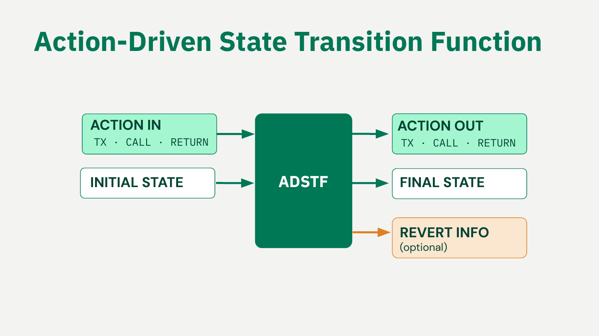
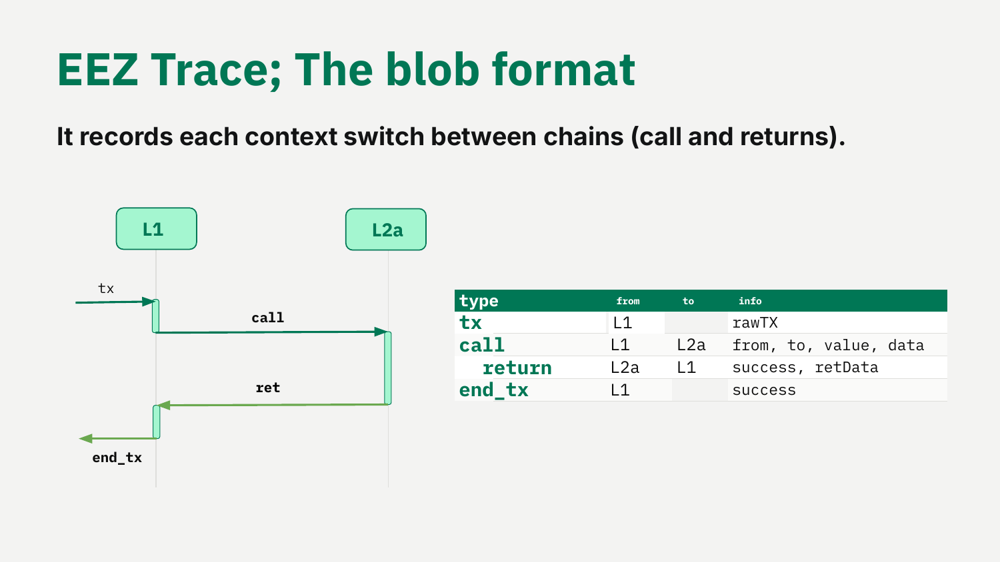
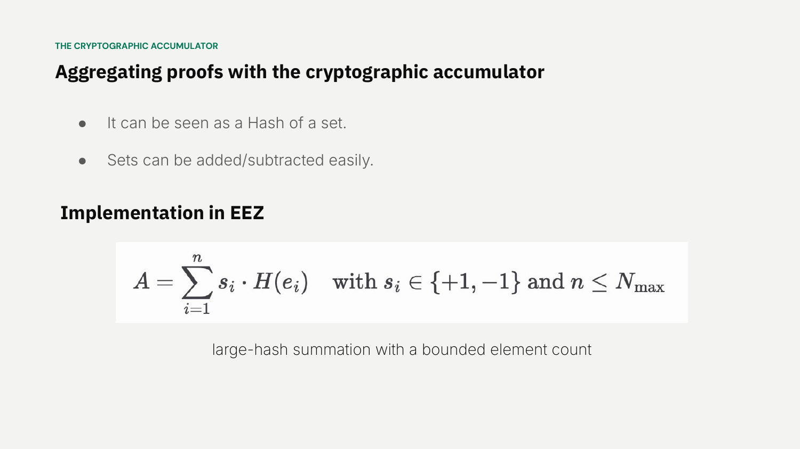
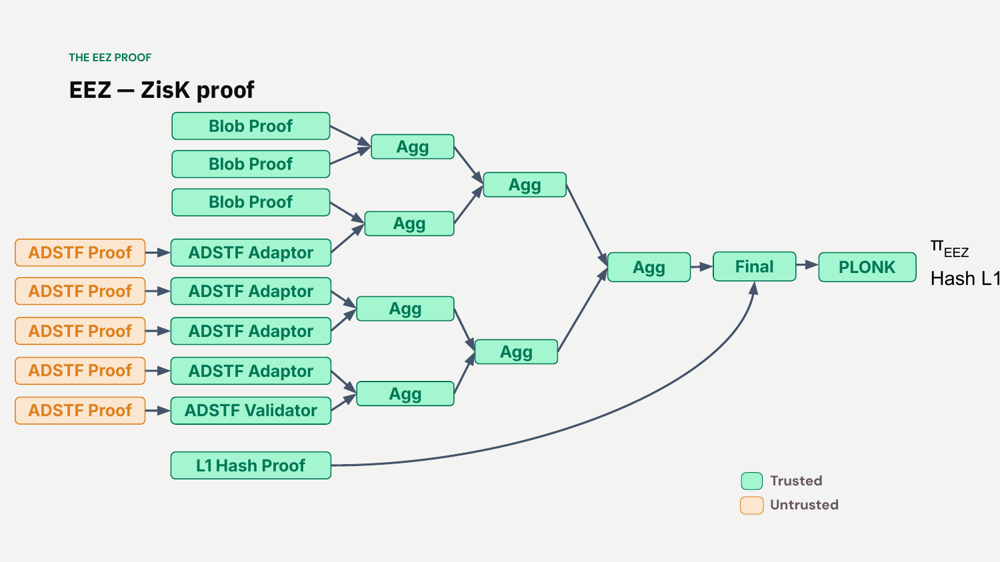

# Real-Time Proving with ZisK


*Explainer 7 of 8. [Series index](README.md). Status, sourcing and caveats: [Conventions & Caveats](00-conventions-and-caveats.md).*

This explainer is for builders and partners who want to understand how the [EEZ](GLOSSARY.md) generates proofs fast enough to make synchronous cross-rollup execution work. It covers the [ADSTF](GLOSSARY.md), the [EEZ Trace](GLOSSARY.md) blob format, the recursion pipeline step by step, how each rollup configures its own proving systems and verification threshold, and why low proof-generation latency is what makes a single synchronous cross-rollup step possible at all.

A status note on [ZisK](GLOSSARY.md). At the dedicated ZisK / Real-Time Proving talk (not the BuilderRoom workshop this series otherwise draws on, which does not cover these specifics) Jordi announced **ZisK 1.0 alpha**: the code is frozen and usable, but kept at "alpha" because soundness is not yet fully confirmed. ZisK is an open-source, RISC-V 64-bit ZKVM, designed to be post-quantum, with 128-bit security. The next phase is auditing and AI-assisted formal verification of the circuits. Treat ZisK as early and moving, not finished.

The talk is branded around ZisK, so it is easy to read EEZ as a single-prover system. It is not. ZisK is one [proof system](GLOSSARY.md) among several, and each rollup chooses its own ([Conventions & Caveats](00-conventions-and-caveats.md), distinction 4). Hold that point through the whole document; we return to it in the multi-prover section.

## The Action-Driven State Transition Function (ADSTF)

[ADSTF](GLOSSARY.md) is the deck's conceptual framing for the per-rollup state transition; the shipped contracts express it as [execution entries](GLOSSARY.md), state deltas, and a rolling hash, with no type literally named ADSTF (see [Conventions & Caveats](00-conventions-and-caveats.md)). We keep ADSTF as the conceptual name throughout.


*From Jordi's DAPPCon deck (slide 14): the action-driven state transition function (ADSTF).*

A normal state transition function takes a starting state and a block of transactions, and produces an ending state. EEZ needs more than that, because a rollup in EEZ does not run in isolation. It can be called by another rollup, and it can call out to another rollup, all inside the same proven step.

The ADSTF captures this. It runs like so:

```
ACTION IN  →  INITIAL STATE  →  ADSTF  →  FINAL STATE
                                       →  ACTION OUT
                                       →  REVERT INFO
```

Read the inputs and outputs as a single shape. The ADSTF takes an incoming action and the rollup's initial state. It produces three things: the final state of that rollup, an outgoing action (the rollup's own CALL or RETURN to another chain), and revert information recording what should be undone if any part of the combined step fails.

The action in and action out are how the function expresses cross-chain behaviour. Inside a [native rollup](GLOSSARY.md), the work the function performs is made of [execution entries](GLOSSARY.md), not transactions. The action in is a CALL or RETURN arriving from another chain; the action out is a CALL or RETURN this rollup sends to another chain. Because the function names both its inputs and its cross-chain effects explicitly, the proof can reason about cross-chain interaction directly, rather than treating it as an external side effect that happens somewhere off to the side.

The revert info matters for atomicity. A synchronous cross-rollup step either fully happens or fully unwinds. The ADSTF emits enough information at each step to reverse it, so a revert anywhere in the combined execution can roll the whole step back cleanly.

## The EEZ Trace blob format

The ADSTF describes what one rollup does. The [EEZ Trace](GLOSSARY.md) describes how the rollups hand control to each other.

The deck calls it "the blob format."


*From Jordi's DAPPCon deck (slide 11): the EEZ Trace blob format.*

It records each context switch between chains. A context switch is a CALL, where one chain hands execution to another, or a RETURN, where execution comes back. The trace records both directions. It also records reverts, so the unwinding of a failed step is part of the same record as the forward execution.

Think of the EEZ Trace as the authoritative log of the combined execution. It is not a per-chain log stitched together after the fact. It is one ordered record of every boundary crossing in the step. Chain 1 calls Chain 2; the trace records the switch. Chain 2 runs and returns; the trace records the switch back. If Chain 2 reverts, the trace records that too, alongside the revert info the ADSTF produced.

This single ordered record is what the proving pipeline proves over. The pipeline does not prove each chain on its own and hope the pieces fit. It proves that the whole trace, every context switch in order, is consistent and valid.

## The recursion pipeline, step by step

EEZ proves the combined execution through a chain of recursive circuits. Each circuit verifies the output of the one before it, so the final proof stands in for all the work underneath it. This is genuinely sequential, so a numbered walk-through is the clearest way to read it.

1. **ADSTF Adaptor.** This is the entry point. Each rollup defines its own state transition function and supplies a circuit for it. The ADSTF Adaptor verifies a user-defined circuit verification key (VK). In plain terms, it checks that the rollup ran the state transition function the rollup itself committed to, and nothing else. Because rollups are sovereign and define their own rules and their own accepted proving systems, this adaptor step is where each rollup's own choices get checked against its own declared VK.

   The adaptor does this with one level of recursion: it recursively verifies the rollup's own circuit against the VK configured in the smart contract, then folds the result into the full proof. Jordi calls this the key trick, because it lets EEZ prove state transitions for rollups whose function is not defined yet. A rollup that joins next year brings its own circuit and its own VK. The verification key is not fixed at the protocol level: it is supplied by the rollup's own manager contract at proving time and can change (via the rollup's governance, DAO, or owner). The adaptor verifies against whatever VK the manager returns for that batch, so new rollups can join, and existing ones can evolve, without the protocol pre-committing to anything about their internals.

2. **L1 Hash Builder.** This circuit ties the proof to L1. It handles the blob commitment, so the data the proof covers is the data actually posted. It records the starting and ending blob rollup state, so the step has a defined before and after on L1. It captures the L1 interactions for the step. And it carries the mapping from each RollupId to the proof system and VK that rollup uses. This mapping is the bridge between the abstract proof and each rollup's own in-contract configuration of which proving systems it allows, which we cover in the next section.

3. **Aggregation Circuit.** This circuit verifies two proofs at once and adds their [accumulators](GLOSSARY.md) together. The accumulator is the mechanism that makes the whole pipeline work, so it is worth understanding. It is hash-like and order-independent (combining two elements gives the same result whichever order you combine them, the way a set ignores order), but it is an additive, group-like accumulator rather than a one-way cryptographic hash: it supports combining *and un-combining* elements, which is what lets the pipeline subtract later.

   Each proof adds elements to the accumulator when it assumes something, and subtracts elements when it proves that assumption. Parsing a blob, for example, assumes each rollup's state transition function is correct (it adds it); the ADSTF Adaptor then proves that function (it subtracts it). Aggregating two proofs is just adding their accumulators. Because the accumulator ignores order, you can aggregate as you generate, with no fixed sequence. The circuit pairs proofs together until a single root aggregation remains.

   The same add/subtract bookkeeping also chains the blobs together. When blobs and proofs connect, the intermediate states at each join cancel: one blob's end state subtracts against the next blob's start state, leaving only the very first start state and the very last end state surviving in the accumulator. Those surviving start and end states are exactly what feed into the L1 Hash Builder's record of the starting and ending blob rollup state. So the accumulator does not cancel away to nothing; it cancels down to the step's true before-and-after, which is what gets anchored to L1.


*From Jordi's DAPPCon deck (slide 43): aggregating proofs with the cryptographic accumulator.*

4. **Final Circuit.** This circuit verifies the root aggregation together with the L1 Hash Builder, then performs a critical check: it confirms the accumulator sum equals zero. The zero check is the closing argument. Everything assumed somewhere in the tree must be proved somewhere else, so every added element must have a matching subtracted element. If that holds, the accumulator cancels out to zero. A non-zero sum means something was assumed but never proved, and the proof fails. So this one check stands in for the correctness of everything aggregated below it.

5. **PLONK Circuit.** The recursive proof up to this point is efficient to build but not cheap to verify on chain. The final stage wraps it in a PLONK proof, which is easy to verify on chain. This is the proof the L1 contract actually checks. The whole pipeline exists to compress the combined execution of many rollups into this one onchain-verifiable artifact.


*From Jordi's DAPPCon deck (slide 44): the ZisK proof pipeline.*

Read the pipeline as a funnel. Many per-rollup proofs go in at the ADSTF Adaptor. The L1 Hash Builder anchors them to L1. The Aggregation Circuit folds them together. The Final Circuit checks the fold closed cleanly with the zero-accumulator test. The PLONK Circuit produces the single proof that settles on L1.

## Multi-prover capability

Now the point we flagged at the top. EEZ is proof-system agnostic and multi-prover-capable. Each rollup chooses its own proving systems and its own verification threshold on its own [manager contract](GLOSSARY.md), and a security-conscious rollup picks two or more. The protocol does not force a minimum of two; the threshold is the rollup's choice (see [Conventions & Caveats](00-conventions-and-caveats.md), distinction 4).

**For builders** (contract names current as of June 2026; the EEZ contracts are unaudited and not production-ready, and error semantics are expected to change, so treat these symbols as indicative, not stable):

- `threshold`: an owner-set value on the manager contract, any value including one.
- `checkProofSystemsAndGetVkeys(...)`: returns the per-system verification keys for a batch.
- Its reverts: `ThresholdNotMet(submitted, required)` when too few proofs are supplied, and `ProofSystemNotAllowed` when a batch names an unconfigured system.
- `_fetchVkMatrix(...)`: helper that builds the per-rollup VK matrix (tracking which systems each rollup configured), feeding off structures like `ProofSystemBatchPerVerificationEntries`.
- `InvalidProofSystemConfig()`: a separate registry-side structural error (empty list, proof-count mismatch, wrong ordering); don't confuse it with the threshold check, as it is not thrown by `checkProofSystemsAndGetVkeys`.

This is why ZisK branding on the talk does not make EEZ a ZisK system. ZisK is one valid proving system; the EEZ properties list names ZK, TEE, and multisig as acceptable types, and a rollup is free to choose something like ZisK plus SP1 plus a TEE. The reason is robustness: if one system has a bug, the others still have to agree before a batch settles, so a single compromised prover cannot push an invalid state through. Multi-prover is the security design intent, and likely an EEZ-zone policy recommendation, but the contract does not force it.

Gnosis Chain is the concrete proof of this flexibility. Its first proof system is not zk at all. It is a validator multisig: bridge validators re-execute every block on diverse clients and sign, and the M-of-N attestation is the proof the EEZ contracts verify. The plan is to add zk verifiers to the same threshold over time and retire the signers, with the contracts unchanged throughout. So "proof system" genuinely means whatever the chain configures, from a multisig today to zk later. Explainer 8 covers this path in full.

## Latency and synchronous composability

The deck defines [synchronous composability](GLOSSARY.md) in operational terms: it means minimising proof-generation latency.


*From Jordi's DAPPCon deck (slide 54): bundle building and proof building overlapped, under three seconds.*

That sounds narrow, but it is the heart of the design.

Here is the constraint. EEZ wants a cross-rollup CALL and its RETURN to resolve inside one atomic, proven step that settles on L1. For that step to fit in normal L1 operation, the proof for the combined execution has to be ready within a single L1 slot. So the pipeline targets under three seconds for proof generation.

Name what that figure refers to: the under-three-seconds target is the proof-generation budget inside one L1 slot (**not a finality number**). EEZ has several distinct timing numbers; for the full timing model (native ~12 s, async ~20 min, proof-gen < 3 s) see [Conventions & Caveats](00-conventions-and-caveats.md).

EEZ hits the target by overlapping work. Bundle building (done by the [composer](GLOSSARY.md)) and proof building run at the same time rather than one after the other. The composer assembles the cross-rollup bundle while the prover is already at work. Helper data can be streamed to the prover so it starts early, before the full bundle is final. The L1-state-independent portion of the proof can begin immediately. Only the part that depends on the final L1 block hash has to wait. By the time the bundle is complete, much of the proof is already done.

The order-independent accumulator is what makes this pipelining possible. Because aggregation does not need a fixed order, the prover starts as soon as the batch begins. As each blob and each transaction is created, its proof can be generated and aggregated straight away, rather than waiting for the batch to close. The aim is that by the time block-building stops, almost all the work is finished and only a small final part remains. That final part is the roughly three-second figure Jordi cites, and the team expects to push it lower. So the three seconds is not the whole proving time; it is the minimal remaining work at the end of an otherwise continuous pipeline. In the timing model Jordi sketches, the proof starts roughly three to four seconds before the slot and is published to the builder about half a second before, where it is inserted as a regular transaction.

On hardware, Jordi is deliberately unromantic. The prover runs on a cluster of standard GPUs and scales well across them. Special-purpose ZK hardware is not the plan: ZK is still evolving too fast for fixed silicon to keep up, so the team is betting on commodity GPUs rather than custom accelerators. In his words, no miracles. For a document about "real-time proving," that is the honest anchor: the speed comes from pipelining and recursion on ordinary hardware, not from exotic chips.

This is why real-time proving is the enabling piece, not a performance nicety. Synchronous cross-rollup execution means a contract on one rollup calls a contract on another and gets its answer inside the same proven step, with shared state, before anything settles. That is only possible if the proof of the combined execution can be produced inside the settlement window. If proving took minutes, the interaction would have to break into separate steps on separate timelines, which is exactly the asynchronous model EEZ is built to avoid. Fast proving is what keeps the CALL and the RETURN in one atomic unit. Take the speed away and the synchronous property goes with it.

So the pipeline and the latency target are two halves of one idea. The recursion pipeline makes the combined execution provable and cheap to verify on chain. The overlapped bundle and proof building make that proof arrive in time. Together they let many rollups behave, for the length of one step, like a single machine.

*Source: DAPPCon Berlin 2026. `knowledge/eez/sources/dappcon-2026-eez-node-architecture.md` (EEZ Workshop deck) and `knowledge/eez/sources/dappcon-2026-realtime-proving-talk.md` (Jordi Baylina's "Real-Time Proving and Synchronous Composability Between Rollups", 16 June 2026). Co-branded Ethereum Economic Zone × ZisK VM; ZisK is at 1.0 alpha and is a roadmap item. Quote as Jordi's framing, not approved EEZ comms.*
