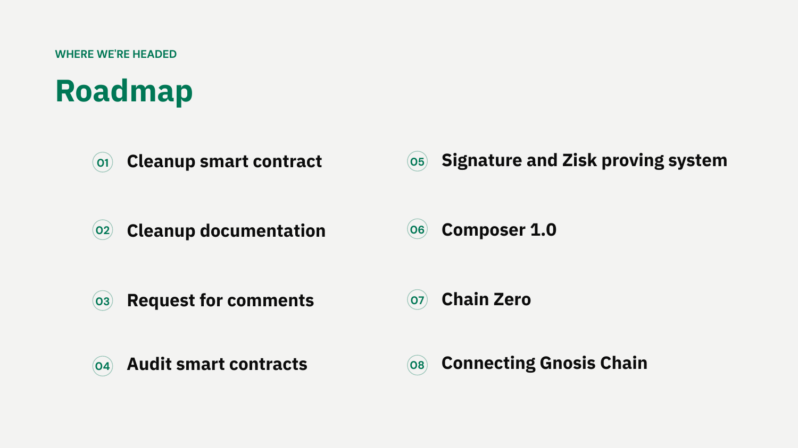

# Gnosis Chain: The First EEZ Chain

*Explainer 8 of 8. [Series index](README.md). Status, sourcing and caveats: [Conventions & Caveats](00-conventions-and-caveats.md).*
*Pre-GIP: public via the Dappcon talk, but check current GIP status before any external comms. Testnet prototype, not mainnet.*

This explainer is a case study. The others describe EEZ in general; this one describes what it takes for one real chain, Gnosis Chain, to become an EEZ chain, and what the team has already built. It is the concrete form of the "Connecting Gnosis Chain" roadmap item.

## Why Gnosis Chain

Gnosis Chain has run since 2018 and is, in Phillipe's words, basically Ethereum with slight variations: faster blocks (five seconds today, against twelve on Ethereum), faster finality, and GNO as an ERC-20 staking token rather than the native asset, but the same client architecture and beacon chain. It is a live network, running apps like Circles and Gnosis Pay. That closeness to Ethereum is what makes the move feasible. The pitch is direct: becoming an EEZ chain is "not an add-on. It touches blocks, proofs, validators, and consensus." This is a real change to the chain, not a contract deployed on top.

The work this explainer describes is Gnosis Chain itself becoming an EEZ chain while keeping a [sequencer](GLOSSARY.md) and faster block times. A live based-rollup prototype (no sequencer of its own, driven by Ethereum block timing) already runs on the Chiado testnet, which is what makes the move concrete rather than theoretical. (Martin Köppelmann's separate same-day talk frames a broader rollup roadmap; that framing is not verified against the protocol repo and is out of scope here.)

## What makes an EEZ chain: four integration points

The talk frames the work as four integration points; the chain stays sovereign in everything else.

1. **Reorgs with Ethereum.** The chain adopts Ethereum's fork choice as its own. When Ethereum reorgs, the EEZ chain follows.
2. **EEZ contracts.** One contract set on Ethereum, shared across the zone, where many chains are proven and batched together.
3. **A composer.** The chain runs, or shares, the [composer](GLOSSARY.md) that simulates synchronous blocks across chains ([Explainer 5](05-the-composer.md)).
4. **Cross-chain proxies.** The chain addresses the rest of the zone through local [proxies](GLOSSARY.md) ([Explainer 2](02-proxies-and-execution-table.md)).

Everything else stays the chain's own choice: block production, permissioning, the proof system, and data availability. This is the sovereignty principle from [Explainer 3](03-eez-properties-and-sovereignty.md), made concrete as an integration surface. A chain adopts four things and keeps the rest.

## The trust model is a parameter: multisig today, zk tomorrow

This is the most important design choice and a clean illustration of how EEZ proving works. Each chain sets its own [proof system](GLOSSARY.md) and threshold on its own [manager contract](GLOSSARY.md) (details: [Conventions & Caveats](00-conventions-and-caveats.md)). Gnosis Chain uses that freedom to start simple and harden over time.

| Stage | Proof system | Detail |
|---|---|---|
| Today | BLS × N validator multisig | N bridge validators re-execute every block, each on a *diverse* client (client diversity across the set), then sign. The M-of-N attestation *is* the proof; Ethereum's EEZ contracts verify it. Client diversity is what makes it trustworthy. The live prototype is simpler still: a single mock ECDSA signer, so proofs are a mock today. |
| Next | BLS + zk hybrid | Add a zk verifier to the set, then another, and raise the threshold. |
| Goal | zk × 3, retire signers | Three independent zk provers (the zk-era diversity goal), so the permissioned signers leave the critical path. |

The line that ties it together: "same protocol, different proof systems. Upgrading trust never changes the contracts." The zk provers later slot into the same M-of-N threshold the multisig used. A proof system can be a validator multisig, not only a zk system, and the threshold is the chain's choice.

Concretely, the talk proposes reusing Gnosis Chain's existing bridge validators. Today they validate transactions and bridge them; under EEZ each runs a diverse client, validates locally that the block the sequencer and composer produced is correct, then attests. The set as a whole attests M-of-N, with client diversity across validators standing in for proof diversity. The aggregated attestations are posted with `postAndVerifyBatch`, and that aggregate is the proof. Phillipe gives two reasons zk is not the starting point: the zk-era goal is at least three independent zk provers, all able to prove in real time, before relying on zk alone; and real-time zk proving is still a little too slow for the chain's needs today. Multisig first is a move-fast choice, not the end state.

## What is already built

The team treats this as buildable, not theoretical. Roughly three months from idea to a running prototype.

- **February 2026:** Jordi Baylina's ethresear.ch post.
- **April 2026:** a full prototype, a based rollup built on reth, live on Chiado (the Gnosis testnet).

The prototype demonstrated three things, all as single atomic operations across chains:

| Demonstrated | What it shows |
|---|---|
| Instant deposits and withdrawals | Atomic, in both directions. |
| Calls with return values | L1 reads an answer computed on L2 inside the same transaction. |
| Cross-chain flash loans | Borrow, work, and repay across chains in one transaction. |

What is demonstrated today is the single synchronous call: one call out, optional work on the other chain, one return. The running prototype carries this restriction deliberately. In Friederike's framing, "nested calls will come later." Deep nested calls, where execution ping-pongs between chains mid-transaction, are roadmap, not a shipped capability (see "Where it is going").

A point that matters for node operators: independent full nodes re-derive identical state from L1 alone. You do not need to trust the sequencer's word, and you do not need to follow the other chains. This is the client model from [Explainer 6](06-node-architecture.md), shown working.

## Design decisions

| Decision | Why |
|---|---|
| Sequenced, two-second blocks | EEZ needs sequencing, and Gasper (the beacon chain's consensus) was not built for it. Two-second blocks are hard in a fully decentralised attest-every-block design; composing is heavy, since the composer runs Gnosis Chain plus Ethereum plus any other chains it composes with; and Gasper finalises on its own rather than following another chain's reorgs, which is exactly what an EEZ chain must do. Rebuilding all the consensus clients to fix this does not make sense, so the chain is sequenced. |
| Six blocks per Ethereum block | Two-second blocks give six per twelve-second Ethereum block. One can be a [sync block](GLOSSARY.md) carrying synchronous cross-chain interactions; the rest are ordinary L2 blocks, signed by the sequencer (permissioned to begin with). With no cross-chain work, the chain builds ordinary blocks and still posts a sync block per Ethereum block (~12s), anchoring state to Ethereum each slot so L1's view of the L2 state root stays current and posting the state roots and call data a follower needs. |
| Multisig start | The proof system begins as a validator multisig and moves to zk over time (see table above). |
| Blobs on Ethereum | Cross-chain interactions are posted as blobs on Ethereum, which is why data availability is a real dependency ([Explainer 6](06-node-architecture.md)). Trade-off: ripping out beacon-chain consensus loses some of what that layer provided (blobs among them), so the chain leans on Ethereum instead. |
| Validator set deprecation | The current Gnosis validator set is most likely deprecated under this model. The decision sits with the DAO, through a GIP, not with the team. |

## Composer v1: start narrow

The team plans to ship a deliberately limited composer first. Composer v1 allows one incoming call from Ethereum, then one call into Gnosis Chain (which can do whatever it likes internally), then one return back to Ethereum. That is not full nested composability, but Phillipe estimates it delivers seventy to eighty per cent of the value: it already covers patterns like swapping on Ethereum, bridging to Gnosis Chain, liquidating a position there, and bridging back, all in one atomic transaction. Full nested composability, many hops back and forth in one transaction, is the longer-term goal.

## Follower nodes

For node operators, the model changes but stays familiar. A follower node receives blocks from the sequencer every two seconds, then checks each batch posted to Ethereum (whether a sync block or a periodic anchor) against the state it received from the sequencer. It does not have to trust the sequencer's word; it confirms against L1. Running a private RPC, doing local simulations, and so on stay the same. For most operators this is a client update.

## Timing: pre-building (a future, zk-only concern)

On a twelve-second Ethereum slot, the visible cost of EEZ is mostly timing. Two timing issues are still open. First, L1 inclusion is not known quickly enough: if the chain only learns after a couple of seconds that its bundle landed, it is unclear which block to build the next one on, so it may build variations and keep the right one. Second, zk proving needs a few seconds at the end of a slot, which would force the last couple of blocks before a sync block to be empty. The proposed answer is pre-building: build those blocks early, around t+8, so the prover finishes before the L1 block closes, at the cost of running on slightly stale data. Phillipe is explicit that this proving-time issue does not arise with the multisig proof system the chain starts on. It only becomes a concern once the chain moves to full zk proving. So pre-building is a future optimisation, not a day-one requirement.

## Where it is going

The roadmap, in the team's framing, runs from a forum post to Gnosis Chain on the EEZ, and the closing pitch is "one zone, one UX." The timeline is aggressive but staged:

- **Now:** a live deployment with the most recent contracts (partial functionality) already runs on Chiado, the Gnosis test network, alongside the earlier devnet.
- **August:** the reference rollup deploys as Rollup 0 (which becomes Rollup 1 as it is upgraded), a vanilla, fully based rollup sequenced by L1 validators.
- **End of summer:** a deployment on Ethereum itself, able to hold real value. The team is explicit that this ships as a *testnet*: Martin's caveat is "use at your own risk," it will be only "slightly audited," and it carries a "big warning to not use it with real money."
- **Optimistically by end of year:** Gnosis Chain joins as an EEZ L2 in a *limited* capacity. Synchronous single calls, with full shared liquidity targeted for the same window but nested calls coming later (Friederike's framing). The launch prover is a compromise: not purely zk, but partially zk complemented by a multisig/TEE, what the team calls a "fancy multisig." This is the multisig-today, zk-tomorrow path from the trust-model table above.

Full nested composability and a move to fuller zk proving follow that. A couple of other L2s have expressed interest, with no concrete timeline.

The honest trade-off (the talk's "Honest Ledger" slide): becoming an EEZ chain trades Gnosis Chain's own ~2.5-minute finality for Ethereum's ~15-minute hard finality. That cost is offset by two-second signed pre-confirmations for users and by inheriting Ethereum-grade security. For the broader EEZ roadmap that this sits inside (Composer 1.0, Chain Zero, Connecting Gnosis Chain), see the [series index](README.md).

*From Jordi's DAPPCon deck (slide 55): the roadmap.*

All of these dates are targets, not commitments, and the whole plan still runs through a GIP.

*Source: `knowledge/eez/sources/dappcon-2026-gnosis-chain-eez-talk.md` (Phillipe Schommers, Gnosis Head of Infrastructure, Dappcon Berlin 2026), with context from Martin Köppelmann and Jordi Baylina's same-day talks.*
