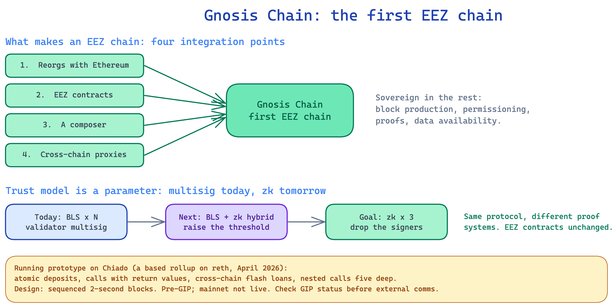

# Gnosis Chain: The First EEZ Chain

*Source: `knowledge/eez/sources/dappcon-2026-gnosis-chain-eez-talk.md` (Phillipe Schommers, Gnosis Head of Infrastructure, Dappcon Berlin 2026), with context from Martin Köppelmann's and Jordi Baylina's same-day talks. Engineering-level founding material, not approved EEZ comms. This is reference-grade and a draft until Armagan signs off. The Gnosis-as-EEZ-chain plan is pre-GIP: it is now public via the Dappcon talk, but check the current GIP status before building any external comms around it. Mainnet is not live; the work below is a testnet prototype and a roadmap.*

This explainer is a case study. The other explainers describe EEZ in general. This one describes what it takes for one real chain, Gnosis Chain, to become an EEZ chain, and what the team has already built. It is the concrete form of the "Connecting Gnosis Chain" roadmap item.

## Why Gnosis Chain

Gnosis Chain has run since 2018 and is, in Phillipe's words, basically Ethereum with slight variations: faster blocks (five seconds today, against twelve on Ethereum), faster finality, and GNO as an ERC-20 staking token rather than the native asset, but the same client architecture and beacon chain. It is a live network, running apps like Circles and Gnosis Pay. That closeness to Ethereum is what makes the move feasible. The pitch is direct: becoming an EEZ chain is "not an add-on. It touches blocks, proofs, validators, and consensus." So this is a real change to the chain, not a contract deployed on top.

The team is taking two parallel tracks, which Martin Köppelmann set out in his talk. Gnosis Chain itself will become an EEZ chain while keeping a sequencer and faster block times. In parallel, the team is building **Rollup One**, a fully based EEZ chain (no sequencer of its own, driven by Ethereum block timing), which starts life as a testnet called **Rollup Zero** and hardens into Rollup One over time. This explainer is mostly about the Gnosis Chain track.

## What makes an EEZ chain: four integration points

The talk frames the work as four integration points, with the chain staying sovereign in everything else.

1. **Reorgs with Ethereum.** The chain adopts Ethereum's fork choice as its own. When Ethereum reorgs, the EEZ chain follows.
2. **EEZ contracts.** One contract set on Ethereum, shared across the zone, where many chains are proven and batched together.
3. **A composer.** The chain runs, or shares, the builder that simulates synchronous blocks across chains. See explainer 5 for the composer in general.
4. **Cross-chain proxies.** The chain addresses the rest of the zone through local stand-ins. See explainer 2 for proxies and the Execution Table.

Everything else stays the chain's own choice: block production, permissioning, the proof system, and data availability. This is the sovereignty principle from explainer 3, made concrete as an integration surface. A chain adopts four things and keeps the rest.

## The trust model is a parameter: multisig today, zk tomorrow

This is the most important design choice, and it is a clean illustration of how EEZ proving actually works. EEZ is proof-system agnostic, and each chain sets its own proof system and its own M-of-N threshold. Gnosis Chain uses that freedom to start simple and harden over time.

- **Today: BLS times N validators.** The proof system is a multisig. Bridge validators re-execute every block on diverse clients, then sign. The M-of-N attestation is the proof, and Ethereum's EEZ contracts verify it. Client diversity is what makes the attestation trustworthy.
- **Next: BLS plus zk hybrid.** Add a zk verifier to the set, then another, and raise the threshold.
- **Goal: zk times three.** Drop the signers, so the permissioned actors retire from the critical path.

The line that ties it together is "same protocol, different proof systems. Upgrading trust never changes the contracts." The zk provers later slot into the same M-of-N threshold the multisig used. Nothing in the EEZ contracts changes when the proof system does. This is exactly the per-rollup, owner-set threshold that the protocol code implements, so it is worth stating plainly: a proof system can be a validator multisig, not only a zk system, and the threshold is the chain's choice, not a fixed protocol rule.

Concretely, the talk proposes reusing Gnosis Chain's existing bridge validators. Today those validators validate transactions and bridge them. Under EEZ they could become the chain's validators: each runs three different client implementations, validates locally that the block the sequencer and composer produced is correct, then attests. The aggregated attestations are posted with `postAndVerifyBatch`, and that aggregate is the proof. Phillipe gives two reasons zk is not the starting point. First, the team wants at least three independent client implementations and zk provers, all able to prove in real time, before relying on zk alone. Second, real-time zk proving is still a little too slow for the chain's needs today. Multisig first is a move-fast choice, not the end state.

## What is already built

The team treats this as buildable, not theoretical. The timeline given was roughly three months from idea to a running prototype.

- **February 2026:** Jordi Baylina's ethresear.ch post.
- **April 2026:** a full prototype, a based rollup built on reth, live on Chiado, the Gnosis testnet.

The prototype demonstrated four things, all as single atomic operations across chains:

- Instant deposits and withdrawals, atomic, in both directions.
- Calls with return values, where L1 reads an answer computed on L2 inside the same transaction.
- Cross-chain flash loans: borrow, work, and repay across chains in one transaction.
- Nested calls five levels deep, with execution ping-ponging between chains mid-transaction.

A point that matters for node operators: independent full nodes re-derive identical state from L1 alone. You do not need to trust the sequencer's word, and you do not need to follow the other chains. This is the client model from explainer 6, shown working.

## Design decisions

The headline choices are sequenced blocks, a multisig start, and blobs on Ethereum.

- **Sequenced, two-second blocks.** EEZ needs sequencing, and Gasper, the beacon chain's consensus, was not built for it. Phillipe gives three reasons. Two-second blocks are hard to run in a fully decentralised attest-every-block design. Composing is a heavy operation, because the composer has to run Gnosis Chain plus Ethereum plus any other chains it composes with. And Gasper finalises on its own rather than following another chain's reorgs, which is exactly what an EEZ chain has to do. Rebuilding all the consensus clients to fix this does not make sense, so the chain is sequenced.
- **Six blocks per Ethereum block.** With two-second blocks, the chain produces six blocks per twelve-second Ethereum block. One of the six can be a sync block that carries synchronous cross-chain transactions. The rest are ordinary L2 blocks, all signed by the sequencer (permissioned to begin with). If there are no cross-chain transactions, the chain just builds ordinary L2 blocks and anchors its state to Ethereum every few minutes, posting the state roots and call data a follower needs.
- **Multisig start.** As above, the proof system begins as a validator multisig and moves to zk over time.
- **Blobs on Ethereum.** Cross-chain interactions are posted as blobs on Ethereum, which is also why data availability is a real dependency (see explainer 6). Note a trade-off: ripping out the beacon chain consensus means the chain loses some of what that layer provided, blobs among them, and leans on Ethereum instead.
- **The validator set.** The current Gnosis validator set is most likely deprecated under this model. The decision sits with the DAO, through a GIP, not with the team.

## Composer v1: start narrow

The team plans to ship a deliberately limited composer first. Composer v1 allows one incoming call from Ethereum, then one call into Gnosis Chain (which can do whatever it likes internally), then one return back to Ethereum. That is not full nested composability, but Phillipe estimates it delivers seventy to eighty per cent of the value: it already covers patterns like swapping on Ethereum, bridging to Gnosis Chain, liquidating a position there, and bridging back, all in one atomic transaction. Full nested composability, many hops back and forth in one transaction, is the longer-term goal.

## Follower nodes

For node operators, the model changes but stays familiar. A follower node receives blocks from the sequencer every two seconds, then checks each batch posted to Ethereum, whether a sync block or a periodic anchor, against the state it received from the sequencer. So it does not have to trust the sequencer's word; it confirms against L1. Running a private RPC, doing local simulations, and so on stay the same. For most operators this is a client update.

## Timing: pre-building (a future, zk-only concern)

On a twelve-second Ethereum slot, the visible cost of EEZ is mostly timing. Two timing issues are still open. First, L1 inclusion is not known quickly enough: if the chain only learns after a couple of seconds that its bundle landed, it is unclear which block to build the next one on, so it may build variations and keep the right one. Second, zk proving needs a few seconds at the end of a slot, which would force the last couple of blocks before a sync block to be empty. The proposed answer is pre-building: build those blocks early, around t+8, so the prover finishes before the L1 block closes, at the cost of running on slightly stale data. Importantly, Phillipe is explicit that this proving-time issue does not arise with the multisig proof system the chain starts on. It only becomes a concern once the chain moves to full zk proving. So pre-building is a future optimisation, not a day-one requirement.

## Where it is going

The roadmap, in the team's framing, runs from a forum post to Gnosis Chain on the EEZ, and the closing pitch is "one zone, one UX." The timeline Phillipe gave is aggressive: a working prototype already exists for both the composer and the sequenced chain; a shadow fork on the Chiado testnet is targeted for the end of September; and Gnosis Chain itself for the end of December, with limited EEZ functionality first. Full nested composability and zk proving follow. For the broader EEZ roadmap that this sits inside (Composer 1.0, Chain Zero, Connecting Gnosis Chain), see the series index. All of these dates are targets, not commitments, and the whole plan still runs through a GIP.

## Accuracy notes

- **This is a prototype on a testnet, and the plan is pre-GIP.** The prototype runs on Chiado, not mainnet. The Gnosis-as-EEZ-chain plan is public via the Dappcon talk but has governance still to clear. Frame it as roadmap, and check the current GIP status before any external comms.
- **Proof-system agnostic and multi-prover capable.** The multisig-today, zk-tomorrow path is a real instance of the per-rollup threshold model. A proof system can be a validator multisig. Each chain sets its own M-of-N threshold on its manager contract. There is no protocol-enforced minimum of two, and the EEZ contracts do not change when the proof system does.
- **Proxies, not bridges.** Gnosis Chain reaches the rest of the zone through cross-chain proxies and local stand-ins, not a bridge.
- **Economic zone, not an L2.** Gnosis Chain becoming "an L2" in the talks' shorthand means it joins EEZ as a chain that settles to Ethereum. EEZ itself is the economic zone built on Ethereum, not an L2.
- **Source.** Phillipe Schommers' Dappcon Berlin 2026 talk, with context from Martin Köppelmann and Jordi Baylina the same day. Not approved EEZ comms.
