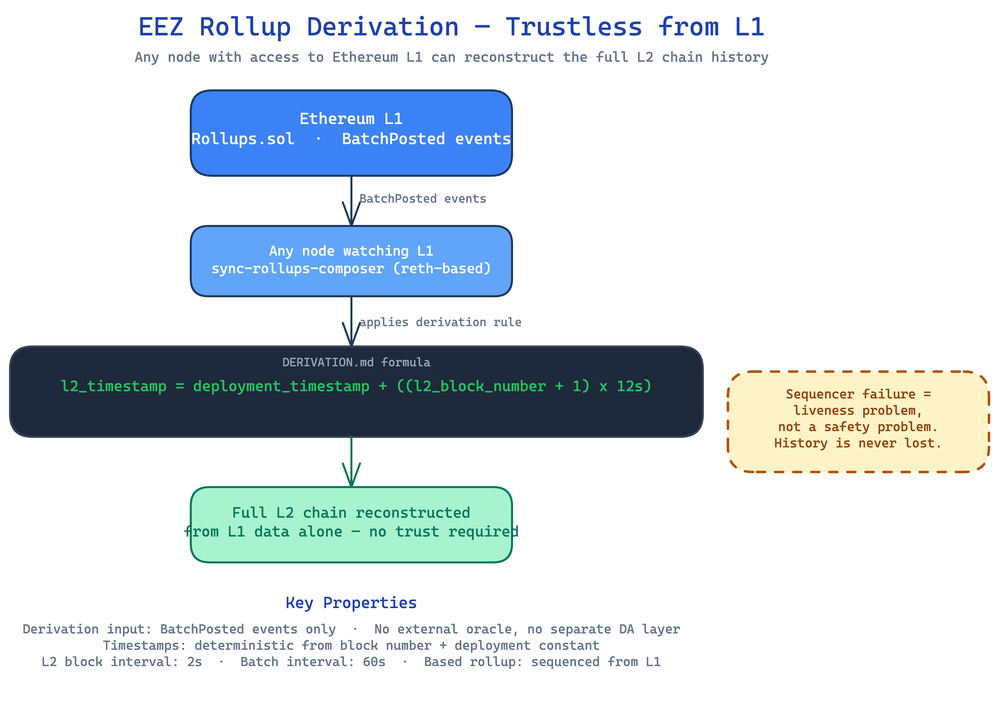

# EEZ Rollups Are Trustless by Design, Here's the Mechanism

**by Armagan Ercan**

---

## The formula that makes trustlessness concrete

`l2_timestamp = deployment_timestamp + ((l2_block_number + 1) × 12s)`

That line sits near the top of DERIVATION.md in the sync-rollups-composer codebase. It is not a comment. It is the chain's timestamp specification. Every L2 block's time is a pure function of two inputs: the deployment timestamp recorded on Ethereum L1 at genesis, and the sequential block number. No oracle feeds it. No off-chain service validates it. The formula is deterministic, and it is verifiable by anyone with access to L1.

That is what "based rollup" means when it is used precisely. DERIVATION.md puts a concrete definition on the table.

---

## What derivation means in practice

Most rollup designs require more than L1 to reconstruct their chain history. A sequencer feed, a data availability layer, a private mempool, a side-channel RPC. Some form of off-chain input sits between the raw Ethereum state and the full L2 history. That is not always a safety problem, but it is a trust dependency. If that off-chain source is unavailable, unreachable, or selectively censored, reconstruction breaks.

The EEZ design removes that dependency entirely. `BatchPosted` is the only L1 event required for full chain derivation. A node that watches Ethereum and catches every `BatchPosted` emission from `Rollups.sol` has everything it needs to reconstruct the complete L2 history.

No sequencer trust. No DA layer assumption. No auxiliary RPC. L1 is the only data source, and L1 is Ethereum.

`Rollups.sol` on L1 is the canonical source of truth. The derivation process reads the batch contents from those events, applies the deterministic timestamp formula to each block, and produces the full chain state. Any node following this process independently arrives at the same result. That is the property that makes the design auditable and the chain reconstructible by parties who have no relationship with the original sequencer.

eez-rollup0 currently posts L2 blocks every 2 seconds and batches to L1 every 60 seconds. That means a watching node receives a new batch roughly once per minute, each carrying 30 L2 blocks worth of data.

---

## The timestamp formula unpacked

Deterministic timestamps matter because timestamps are load-bearing. They affect transaction ordering, fee calculations, and any on-chain logic that uses `block.timestamp`. In most rollup designs, the sequencer assigns timestamps. The sequencer is trusted not to manipulate them. That trust is implicit and rarely spelled out.

The EEZ formula replaces that trust assumption with arithmetic.

`l2_timestamp = deployment_timestamp + ((l2_block_number + 1) × 12s)`

`deployment_timestamp` is the timestamp at which the rollup was registered on L1. It is immutable. `l2_block_number` is the position of the block in the chain, derivable by counting blocks from genesis. Multiply the block position by 12 seconds and add the deployment anchor. The result is the canonical timestamp for that block.

There is no input to this formula that originates off-chain. No sequencer chooses the timestamp. No oracle provides current time. The formula produces a valid timestamp for any block at any point in the future, and that timestamp is independently verifiable by anyone running the derivation.

This matters for auditability. An independent researcher, a regulatory body, or a competing node operator can take a block number and a deployment timestamp and compute what the canonical timestamp should be. If a batch contains a block with a timestamp that does not match, the discrepancy is detectable without trusting any party.

---

## reth as upstream pin, not a fork

sync-rollups-composer is a Rust rollup node. It is built on reth, specifically on `paradigmxyz/reth`, the upstream repository. This is not a fork. The Cargo.toml pins a version of upstream reth. That distinction matters.

A fork introduces maintenance debt. Custom patches diverge from upstream over time. Security fixes require manual backporting. The EVM execution layer starts to drift from the public codebase that the broader community audits. Operators who want to inspect the execution layer have to diff against a moving target.

An upstream pin has a different profile. The EVM execution layer of sync-rollups-composer is the same codebase that the reth community develops and audits. Operators running reth already understand the execution model. The derivation logic in sync-rollups-composer is additive to reth, not a replacement for any of its core components. The derivation layer handles L1 event watching and block reconstruction. The EVM executes the transactions. Those concerns are cleanly separated.

For node operators evaluating the codebase: the reth dependency is a known quantity. The derivation logic is what needs independent review.

---

## What happens when the sequencer fails

The sequencer has one job: read transactions from the mempool and post them to L1 in batches. If it goes offline, no new batches are posted. The chain stops producing new blocks.

That is a liveness problem, not a safety problem.

The L2 history up to the last posted batch is fully intact. Every `BatchPosted` event is on L1. Every timestamp is deterministically computable. Every state transition is reconstructible. No state is corrupted and no history is lost.

Any operator with Ethereum access can reconstruct the complete chain up to the last posted batch, independently, without the sequencer. The sequencer's failure removes the ability to add new blocks, but it does not alter what has already been recorded.

This separation of liveness and safety is the key property for long-term trustlessness. The sequencer is a posting mechanism. It is not a trust assumption embedded in the chain's history. Safety is inherited from Ethereum.

---

## Where to go from here

For anyone evaluating EEZ rollups for integration: DERIVATION.md is the document that answers the trust question. It specifies exactly what a node needs to reconstruct the chain and exactly how timestamps are computed.

Read it alongside `Rollups.sol`. The based rollup property described here is not a positioning claim. It is a spec, derivable, verifiable, and falsifiable. If a node running the derivation process does not produce the expected chain, something in the spec or the implementation is wrong. That is a testable statement.

The codebase is in `eez-association/sync-rollups-composer`. DERIVATION.md is in `docs/`.

**A note on where the protocol is heading.** This post describes the `sync-rollups-composer` node as it stands today, which targets the `Rollups.sol` contract interface (single `postBatch` submission, ECDSA proof). The L1 protocol-contract layer has since been refactored in a separate repository, `eez-association/eez-core-protocol` (renamed from `sync-rollups-protocol`). That refactor moves to a multi-prover `postAndVerifyBatch` model with per-rollup proving thresholds and an `EEZ.sol` registry. The composer node described here is at an earlier snapshot and targets the interface that is being refactored, so if you see different contract and function names in the protocol repo, that is why. The trustless-derivation property described in this post is unchanged by the refactor: L1 remains the only data source, and any node can still reconstruct the full chain from L1 alone.

As evidence the model is being put into practice: at Dappcon Berlin (June 2026), Gnosis Chain announced it will become the first EEZ chain, with a running prototype on the Chiado testnet. This is roadmap and pre-GIP, not a shipped mainnet claim, but it shows the derivation design moving from spec to deployment.
