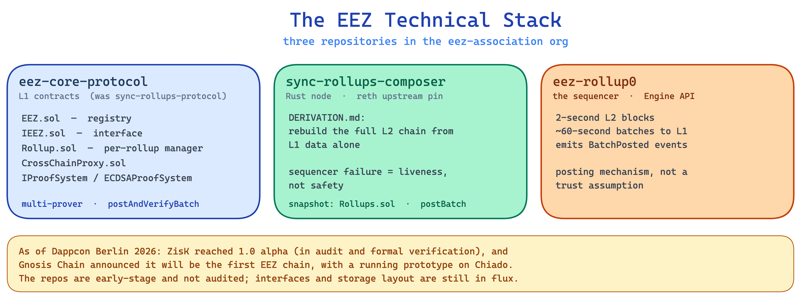

## EEZ's Technical Stack: What's Built and How It Works



### 1. What EEZ is building and where it stands

EEZ is being built to solve Ethereum's fragmentation problem: rollups that cannot compose with each other, liquidity that cannot move atomically across chains, and applications that must choose one L2 ecosystem and accept the tradeoffs. The solution is a shared settlement layer that lets rollups execute cross-chain operations atomically, within a single Ethereum block, without requiring bridges or external trust assumptions.

That is the vision. This post is about the implementation: three active repositories, what each one does, and the architectural decisions that define how synchronous composability actually works at the protocol level. Every claim here traces to a specific file in the eez-association GitHub organisation, re-verified on 19 June 2026.

---

### 2. Three repositories, three layers

The eez-association org contains three active repositories that together describe a complete synchronous rollup system. They are now branded "Sync Rollups".

The first is `eez-core-protocol`. This is the repository that was previously called `sync-rollups-protocol`. It was renamed, and the rename matters because older references and links point at the old name. This is the L1 contract layer: active Solidity, Foundry tests, and a set of formal specification documents. The registry contract is `EEZ.sol`, now around 92.7KB of Solidity, with its interface in `IEEZ.sol`. The per-rollup manager reference implementation is `src/rollupContract/Rollup.sol`. Shared machinery sits in `src/base/`, including `CrossChainProxy.sol`. The proof interface is `IProofSystem.sol`, and the current proof system implementation is `ECDSAProofSystem.sol`. There is no `Rollups.sol` in this repository any more. The registry is `EEZ.sol`. The specs are `CORE_PROTOCOL_SPEC.md` and `EXECUTION_ENTRY_SPEC.md` (renamed from `SYNC_ROLLUPS_PROTOCOL_SPEC.md` and `EXECUTION_TABLE_SPEC.md`), plus `MULTI_PROVER_SPEC.md`, `LOOKUP_SPEC.md`, and `CAVEATS.md`.

The second is `sync-rollups-composer`. This is a Rust implementation based on the reth client, and it is still present. The key detail: reth is an upstream pin, not a fork. The repo includes `DERIVATION.md`, which specifies how any node re-derives the full L2 chain from L1 data alone.

The third is `eez-rollup0`. This is a custom sequencer that connects to a rollup execution client via the Engine API. It targets L2 blocks every 2 seconds, with batches posted to L1.

Together, these three repositories cover L1 contracts, L2 derivation, and sequencer logic. The design is layered, and the boundaries between layers are clearly documented. One thing to flag up front: the contract layer is being refactored. The protocol contracts in `eez-core-protocol` have moved to a multi-prover model, while the composer's current snapshot (May 2026) still targets the older single-proof contract design. More on that below.

---

### 3. Key insight 1: They simplified the execution model

The most interesting engineering decision in the codebase is not something that was added. It is something that was removed.

An earlier version of the protocol used a recursive reentrancy model for cross-chain calls. `ActionType` was an enum that classified cross-chain operations. A scope tree tracked execution scope. The execution engine handled multiple result and revert states, and recursive reentrancy was a live possibility that the contract had to manage.

All of that is gone, and the current code is the clean state. `ActionType` and the scope tree return zero results when you grep the source of `eez-core-protocol`. The only remaining mention is a single line in `CORE_PROTOCOL_SPEC.md` pointing at migration notes. (There used to be a `CHANGES_FROM_PREVIOUS.md` documenting the removal; it no longer exists, so the removal is now simply the current design, confirmable by grepping the repo rather than by reading a changelog.)

What replaced it is described in `CORE_PROTOCOL_SPEC.md`. Cross-chain call sequencing is now handled by a non-recursive while loop. The loop consumes expected cross-rollup interactions one at a time. There is no recursion. There is no scope stack. The contract processes a flat, ordered list of expected interactions and either satisfies them or reverts the batch.

Why does this matter? Recursive reentrancy in cross-chain contexts is one of the hardest correctness problems in smart contract engineering. Every level of recursion multiplies the number of states you need to reason about. The redesign pushes complexity to the prover. The on-chain contract does accounting, not navigation. It checks that the actual sequence of L2 actions matches the pre-computed state transitions. If it does, the batch is accepted. If it does not, the batch reverts.

Settlement now happens through `postAndVerifyBatch()`. This is a change from the older `postBatch()`, and it is not just a rename. The new function is multi-prover. A batch carries an array of proofs (`bytes[] proofs` in `IEEZ.sol`), one per proof system. Each rollup sets its own M-of-N threshold for how many proof systems must attest. The reference manager `Rollup.sol` enforces this: `checkProofSystemsAndGetVkeys` reverts with `ThresholdNotMet` if fewer proof systems attest than the rollup requires. The threshold is the rollup owner's choice. It can be 1, it can be higher, and there is no protocol-imposed minimum of two. EEZ is multi-prover capable, with the threshold set per rollup, not multi-prover by mandate.

This is a meaningful architectural choice. Simpler on-chain logic is easier to audit, easier to formally verify, and reduces the attack surface for settlement bugs. Allowing each rollup to pick its own proof-system threshold lets a chain start conservative and harden over time.

---

### 4. Key insight 2: Any node can re-derive the full chain from L1

`DERIVATION.md` in `sync-rollups-composer` specifies something worth reading carefully: the full L2 chain state is re-derivable from `BatchPosted` events on L1 alone. No other data source is required.

The formula for L2 timestamps is explicit:

```
l2_timestamp = deployment_timestamp + ((l2_block_number + 1) × 12s)
```

L2 block timestamps are deterministic functions of L2 block number and a single deployment-time constant. In the composer's current snapshot, `Rollups.sol` is the canonical source of truth on L1, `postBatch` is the only submission function, and `BatchPosted` is the only event used for derivation. Proof verification in that snapshot is a single ECDSA signature over the public inputs hash. Any node that can read Ethereum can reconstruct the complete L2 history.

This is where the divergence is worth being precise about. The composer's `DERIVATION.md` (a May 2026 snapshot) still describes the single-proof world: `Rollups.sol`, `postBatch`, `BatchPosted`, ECDSA. The contract layer it targets is the one being refactored into `eez-core-protocol`, which has already moved to multi-prover `postAndVerifyBatch` and `EEZ.sol`. The derivation properties themselves still hold for the composer: based-rollup sequencing, a deterministic timestamp formula, and any node re-deriving from L1 data alone. What will change is the contract names and the proof structure the composer reads from.

This is the concrete form of the based rollup property. A based rollup derives its sequencing from L1 rather than a privileged sequencer. The practical consequence is that sequencer failure becomes a liveness problem, not a safety problem. If the sequencer goes offline, no new batches are posted. But no history is lost, no state is corrupted, and any operator with access to L1 data can reconstruct everything that happened up to the last posted batch. Safety is inherited from Ethereum. The sequencer is a posting mechanism, not a trust assumption.

---

### 5. The canonical example: cross-chain flash loans

The `eez-core-protocol` README documents a specific use case: a cross-rollup flash loan executed atomically within a single L1 block.

The sequence works as follows. A user borrows an asset on Rollup A. They use that asset on Rollup B, perhaps to exploit an arbitrage or provide liquidity. They repay the loan on Rollup A. All three steps settle in one L1 block. There is no intermediate state where the loan is outstanding across blocks.

Today, flash loans are single-chain. Moving assets between rollups requires a bridge, which introduces latency (often minutes to hours) and a trust assumption on the bridge operator or security model. Atomicity across chains is not possible with existing bridge designs because the two chains settle independently.

The atomicity guarantee in EEZ comes from single L1 settlement. All participating rollups post their state transitions to the same L1 block, and the `postAndVerifyBatch()` call verifies the batch's proofs (each rollup's chosen proof systems, up to its own threshold) before applying any state. The outcome is atomic by construction. Either everything succeeds and is included in the L1 block, or nothing is. There is no partial settlement.

This is not a theoretical property. It is the direct consequence of the flat sequential execution model and the multi-prover batch design described in section 3.

---

### 6. Honest on the proof system

The current proof system is `ECDSAProofSystem.sol`. It uses ECDSA signatures, not zero-knowledge proofs, and it is explicitly a temporary stand-in.

ZK is the target. The `IProofSystem` interface is designed so that proof systems are interchangeable, and the multi-prover model means a rollup can run more than one at once. Swapping in or adding a ZK verifier is a contract-level change, not a protocol redesign. The interface abstracts over proof type, so the rest of the protocol does not need to change.

For testing, the repo ships `test/mocks/MockProofSystem.sol`. (An earlier draft referred to `MockZKVerifier.sol`; the mock in the current repo is `MockProofSystem.sol`.) It is a mock used for testing the interface, not a production verifier.

Separating the proof system from the protocol and designing for swappability from the start is the correct approach. Shipping ECDSA first lets the team validate the execution model and derivation logic before committing to a specific zkVM. The proof system is a component with a defined interface. When a ZK verifier is ready, the protocol accepts it without redesign.

---

### 7. What's still open

Four areas the public codebase does not yet fully settle.

First, the zkVM choice. This is now partly answered. ZisK, at 1.0 alpha, is the maturing zk proving system in the picture: an open-source RISC-V 64-bit ZKVM. EEZ stays proof-system agnostic by design (the threshold and proof-system set are per-rollup choices), so ZisK is a likely path rather than a hard-wired dependency.

Second, the live design questions the repo itself flags. The old "Stage 3 / Stage 4" framing has been dropped from the docs. The current open items are concrete and listed in `MULTI_PROVER_SPEC.md` (its "Open / pending design decisions" section) and `CAVEATS.md`: how reorgs and cancellation are handled, how multiple composers coordinate, and how composer fee incentives work. These are real, named gaps, not hand-waving.

Third, EIP alignment. Based rollup standardisation on Ethereum is an active area. The codebase does not reference a specific EIP alignment.

Fourth, alliance testnet integrations. There is now concrete news here. At Dappcon Berlin in June 2026, Gnosis Chain publicly committed to becoming the first EEZ chain, with a running prototype on its Chiado testnet.

---

### 8. Where it stands as of Dappcon

As of Dappcon Berlin (June 2026), two things have moved from "planned" to "happening". ZisK is at 1.0 alpha. And Gnosis Chain is publicly committing to become the first EEZ chain, with a prototype on Chiado: sequenced 2-second blocks, starting with a BLS validator multisig as its proof system and moving to zk over time.

This is roadmap, and it is pre-GIP. Mainnet is not live. But it is the first time an established chain has named a date and shipped a working prototype against the EEZ design, which is a meaningful signal for anyone weighing whether synchronous composability is real or theoretical.

For anyone who wants to go deeper, `CORE_PROTOCOL_SPEC.md` in `eez-core-protocol` and `DERIVATION.md` in `sync-rollups-composer` are the most complete public documentation of a synchronous based-rollup system on Ethereum. Start there.
