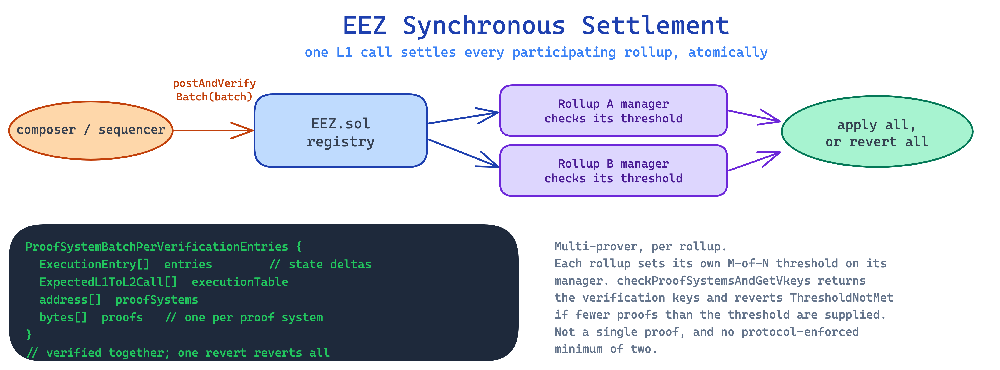

# The Architecture Behind EEZ's Synchronous Settlement

EEZ enables rollups to settle atomically on Ethereum and compose synchronously. A smart contract on one chain calls another, gets a return value, and the whole execution either commits or reverts in a single L1 block. The mechanism that makes this possible is specified across several documents in the `eez-core-protocol` repository (branded Sync Rollups), the main two being `CORE_PROTOCOL_SPEC.md` and `EXECUTION_ENTRY_SPEC.md`, with `MULTI_PROVER_SPEC.md` covering verification. Together they are the most complete public specification of a synchronous based-rollup system on Ethereum. This post walks through what they define.

---

## The settlement model

Settlement in EEZ is a single function: `postAndVerifyBatch(ProofSystemBatchPerVerificationEntries batch)`.

The sequencer calls it once per batch. The batch carries L2 state transitions for all participating rollups, the ordered list of cross-chain execution entries, the set of proof systems used, and a `bytes[] proofs` array. That array is the part to understand. EEZ is not built around a single proof covering the whole batch. It is multi-prover. A batch can carry several proofs, one per proof system, and the contract verifies each of them.

How many proofs a batch needs is decided by each rollup, not by the protocol. Every rollup deploys its own manager contract (the reference implementation is `src/rollupContract/Rollup.sol`) and sets its own `threshold` there. When a batch is submitted, the registry calls that manager's `checkProofSystemsAndGetVkeys(subset)`, which returns the verification keys for the supplied proof systems and reverts with `ThresholdNotMet` if fewer than the rollup's threshold are present. The threshold is an M-of-N choice owned by the rollup. It can be set to 1 (one proof system is enough), or raised as the rollup wants more redundancy. There is no protocol-enforced minimum of two. The protocol enforces whatever each rollup asks for.

The atomic guarantee is unchanged by this. There is still no partial settlement. One L1 transaction settles the state of every rollup included in the batch. If anything in the batch is invalid (a proof fails, a threshold is not met, a call entry is mismatched, a state commitment does not match), the whole transaction reverts. The all-or-nothing property is a property of the settlement function itself, not a coordination layer bolted on top. What multi-prover adds is a choice about how much verification each rollup demands before it will accept a settlement.

`IEEZ.sol` is the canonical L1 interface. `EEZ.sol` is the central registry and full implementation, now roughly 92KB of active Solidity. The size reflects the scope: state update logic, multi-prover verification, cross-rollup call verification, per-rollup execution queues, and registry management are all on-chain. The settlement logic does not delegate the hard parts to off-chain services. It verifies them.

---

## The execution table

`EXECUTION_ENTRY_SPEC.md` defines the structure that makes cross-rollup sequencing deterministic.

Before a batch is submitted, the prover constructs an ordered list of every expected L1-to-L2 interaction that will occur during execution. This list is the execution table. Each entry is an `ExpectedL1ToL2Call`, a data structure that encodes one expected cross-chain call: the source, the target rollup, the calldata, and its position in the sequence.

When the batch is validated on-chain, the contract walks the execution table in order. The protocol uses a flat sequential model: `_consumeNestedAction` is a non-recursive loop that consumes entries from the list one at a time. There is no `ActionType` enum, no `scope[]` array, no recursive reentrancy. The sequencing logic is explicit and linear.

The separation of concerns here is significant. The on-chain verifier is minimal: it checks that the submitted execution matches the committed table, entry by entry. The prover handles the complex call graph off-chain and commits to it before submission. Once committed, the execution is fixed. The on-chain contract does not need to reason about call ordering at validation time. That work was done before `postAndVerifyBatch` was ever called.

This is how pre-computed state transitions work in EEZ. Transitions are generated off-chain and submitted with the batch. The on-chain contract validates them against the committed `ExpectedL1ToL2Call` entries. The chain does not re-execute. It verifies.

---

## The proof interface

`IProofSystem` is a small interface with significant architectural consequences.

It decouples proof verification from the protocol. Any verifier that satisfies `IProofSystem` can validate a rollup's state transitions. The contract does not care whether verification is ZK or ECDSA or a validator multisig. It dispatches to whatever systems a rollup has registered on its manager and accepts or rejects based on the result, against that rollup's threshold.

One of the current implementations, `ECDSAProofSystem.sol`, is explicitly temporary. It exists to allow development and testing while ZK proof systems mature. The interface is designed so that other systems, ZK included, can be swapped in or added without changing the protocol.

This matters for how the spec ages. A rollup can change its registered proof systems and its threshold independently. A new zkVM integration does not require a protocol change. It requires a contract that satisfies `IProofSystem`, registration on the rollup's manager, and a threshold update. The protocol stays stable. The proof systems evolve underneath it.

Gnosis Chain is about to demonstrate this in production. It will join as an EEZ-compatible rollup starting with a BLS validator multisig as its proof system: the bridge validators re-execute each batch on diverse clients, then sign, and the M-of-N attestation is the proof. From there it can add zk verifiers and raise its threshold, with a stated goal of zk-times-three. The same protocol carries both arrangements. Upgrading the trust assumptions never changes the contracts, only what each rollup registers and what threshold it sets. This is the per-rollup threshold and the proof interface working as designed, on a live chain.

ZisK is the zk proving system maturing alongside this. It reached 1.0 alpha as an open-source RISC-V 64-bit ZKVM, post-quantum and 128-bit, currently in audit and formal verification, targeting real-time proving under three seconds. EEZ does not require zk. It remains proof-system agnostic. But systems like ZisK are what a rollup raising its threshold towards zk would register.

For researchers evaluating proof-system agnostic designs in rollup protocols, this is the live reference implementation.

---

## What the spec does not yet settle

The repository is candid about its own status. The README states plainly that this is an early-stage implementation, not audited, with interfaces and storage layout still in flux. The specs are living documents, updated as the design evolves, not a frozen standard.

The honest reading is that the open questions now sit inside the multi-prover and execution machinery rather than in two unwritten future stages. `MULTI_PROVER_SPEC.md` keeps an explicit list of open and pending design decisions. Among them: whether the off-chain `Action` struct and the on-chain `L2ToL1Call` struct should be unified, whether to introduce a per-destination call ID counter for deterministic cross-proof-system ordering and off-chain indexing, and several documented behaviours around registration and rolling-hash format that are flagged for alignment. `CAVEATS.md` records the edge cases that hold today: one deterministic consumption order per queue, the self-contained transient phase (cross-rollup interaction inside the meta hook is only supported between rollups verified together in the same batch), and the opcodes that behave differently across cross-chain proxies.

This is worth stating plainly. What is specified is specified in detail. What is still being decided is written down as such, in the same repository. Anyone building on the spec or evaluating EEZ for integration should read those two files for the current boundary rather than assume the design is settled.

---

## Why read the spec directly

Most Ethereum protocol work is documented across EIPs, ethresear.ch posts, and client implementations. Formal specs at the settlement and execution level, covering function semantics, data structure definitions, and proof interface abstractions, are less common.

`CORE_PROTOCOL_SPEC.md` fills a gap. There is no other public document that specifies, at this level of detail, how a synchronous based-rollup system settles state across multiple rollups in a single L1 transaction, how cross-rollup call sequencing is committed before execution, and how proof verification is abstracted from the protocol and tuned per rollup.

If you are working on rollup architecture and have been relying on secondary summaries of EEZ, the spec is the better source. It is dense in places and incomplete in others. It is also the most precise thing available.

---

*Armagan Ercan is Coordinator at EEZ.*
